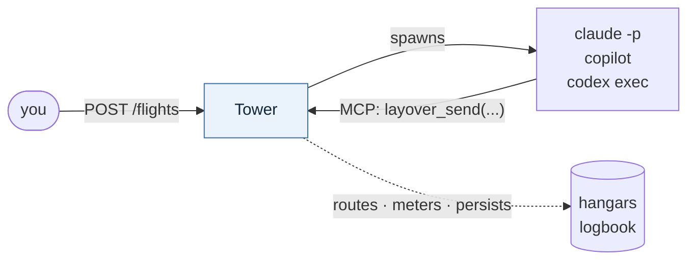

<div align="center">

<picture>
  <source media="(prefers-color-scheme: dark)" srcset="assets/logo-dark.png">
  
</picture>

**A local-first framework for running a lights-out agent factory.**

[](https://github.com/KotkaZ/layover-project/actions/workflows/ci.yml)
[](https://github.com/KotkaZ/layover-project/actions/workflows/pages.yml)
[](https://github.com/KotkaZ/layover-project/actions/workflows/release.yml)
[](https://github.com/KotkaZ/layover-project/releases/latest)
[](LICENSE)

[Documentation](https://kotkaz.github.io/layover-project/) ·
[Install](#install) ·
[Design](docs/architecture.md) ·
[Decisions and open questions](docs/decisions.md)

</div>

> **Status: early implementation.** Layover now runs a factory unattended. `layover serve` fires
> scheduled pipelines, runs what is queued, and serves each agent an MCP endpoint it can call back
> into — so a chain starts on a clock, hands work from agent to agent, waits at a rendezvous for
> several verdicts at once, and finishes with nobody watching. Every hop is bounded by the Hops,
> Fuel and run cap of the one chain that began it. Detail in
> [what works today](#what-works-today).
>
> What has **not** been proven is the thing this project claims: forty-eight hours unattended
> without intervention. Until that soak passes, treat it as working rather than trustworthy.
>
> Pre-1.0 and maintained by one person: expect breaking changes on a minor bump. See
> [project status](#project-status).

Layover does not call LLMs. It is a *supervisor*: it spawns headless agent CLIs, gives them a way
to talk to one another, persists what they learn, and stops them from running away.

You describe a factory in a single `layover.toml` — which agents exist, what each one is for,
which agents may trigger which others, and how work gets in. Layover then runs it unattended.

## Install

Layover is a single binary. No Rust toolchain needed.

```sh
# macOS / Linux — Homebrew
brew install KotkaZ/tap/layover

# macOS / Linux — no package manager
curl --proto '=https' --tlsv1.2 -LsSf \
  https://github.com/KotkaZ/layover-project/releases/latest/download/layover-cli-installer.sh | sh

# Windows
powershell -ExecutionPolicy Bypass -c "irm https://github.com/KotkaZ/layover-project/releases/latest/download/layover-cli-installer.ps1 | iex"

# ...or, since you probably already have Node for the agent CLIs
npm i -g https://github.com/KotkaZ/layover-project/releases/latest/download/layover-cli-npm-package.tar.gz

# ...or from crates.io, if you have a Rust toolchain
cargo install layover-cli
```

> **`layover-cli`, not `layover`.** The bare name belongs to an unrelated SSH tunnelling crate
> whose binary is *also* called `layover`. Install `layover-cli`; the binary it gives you is
> `layover`.

### Download a build

Every release publishes all five targets, plus a `sha256.sum` covering every artifact.

| Platform | Archive |
|---|---|
| Linux x86-64 | [`layover-cli-x86_64-unknown-linux-gnu.tar.xz`](https://github.com/KotkaZ/layover-project/releases/latest/download/layover-cli-x86_64-unknown-linux-gnu.tar.xz) |
| Linux ARM64 | [`layover-cli-aarch64-unknown-linux-gnu.tar.xz`](https://github.com/KotkaZ/layover-project/releases/latest/download/layover-cli-aarch64-unknown-linux-gnu.tar.xz) |
| macOS Apple silicon | [`layover-cli-aarch64-apple-darwin.tar.xz`](https://github.com/KotkaZ/layover-project/releases/latest/download/layover-cli-aarch64-apple-darwin.tar.xz) |
| macOS Intel | [`layover-cli-x86_64-apple-darwin.tar.xz`](https://github.com/KotkaZ/layover-project/releases/latest/download/layover-cli-x86_64-apple-darwin.tar.xz) |
| Windows x86-64 | [`layover-cli-x86_64-pc-windows-msvc.zip`](https://github.com/KotkaZ/layover-project/releases/latest/download/layover-cli-x86_64-pc-windows-msvc.zip) |

All releases: [github.com/KotkaZ/layover-project/releases](https://github.com/KotkaZ/layover-project/releases)

Other options — building from source — are in
[the install guide](https://kotkaz.github.io/layover-project/install.html).

```sh
layover validate --config layover.toml --strict   # check a factory before it runs
layover explain                                   # what can trigger what, and what talks to what
layover prompt tester --flag run_e2e=true         # what an agent would actually be told
```

## The idea

Picture an airport grid.

Each **agent** is an airport. A message is a **Flight**. A chain of flights originating from one
trigger is an **Itinerary**, and it carries the two things that keep the network sane: **Hops**
(how many legs remain) and **Fuel** (how much budget remains). The **Tower** is air traffic
control. One supervised CLI execution is a **Run**; each agent keeps its own notes in its
**Hangar** and shares what everyone should know in the **Logbook**. Work an agent sets down to
pick up later is a **Layover**. When everything needs to stop, you call a **Ground Stop**.

## How it works



- **Sending a message is what starts an agent.** There is no separate spawn step — a flight's
  arrival is what brings an agent to life.
- **Agents talk over MCP.** Layover exposes an MCP server, so Claude Code, Copilot CLI and Codex
  CLI reach it natively with no adapter code.
- **Every run is a clean slate.** Nothing carries over implicitly between runs.
- **Which makes memory explicit.** An agent's continuity is exactly what it chose to write down.
  This is the most opinionated idea in the project, and it is deliberate.
- **The route map is a directed graph.** No edge means the flight is refused.
- **Work enters through pipelines.** Named, triggerable entry points — manual, or on a clock.
- **Prompts compose.** An agent's instructions can pull in extra sections depending on the flags a
  run was triggered with.
- **Runaway swarms are bounded by construction** — every itinerary burns Hops and Fuel, and the
  Tower, not the agent, holds the counters.

## Project status

Maintained by [@KotkaZ](https://github.com/KotkaZ). Contributions welcome — see
[`CONTRIBUTING.md`](CONTRIBUTING.md); vulnerabilities go through
[`SECURITY.md`](SECURITY.md), not the issue tracker.

| | |
|---|---|
| **Stability** | Pre-1.0. A minor bump may break things, and the changelog says when it does. |
| **Versions** | Crate versions track releases of *what is built*. The **first runnable release** — the milestone where a factory actually runs — has not happened yet, and is a goal rather than a version number. |
| **MSRV** | Whatever [`rust-toolchain.toml`](rust-toolchain.toml) pins, currently 1.98. It is the only toolchain tested, so claiming an older one would be a guess. Raised in a minor release. |
| **Platforms** | Developed on Windows, CI on Linux, released for both plus macOS. |
| **Changes** | [`CHANGELOG.md`](CHANGELOG.md) |

## Scope

The first runnable release targets Claude Code, GitHub Copilot CLI and OpenAI Codex CLI, on a
single machine. See [`docs/decisions.md`](docs/decisions.md) for the reasoning, what is still
open, and what is explicitly out of scope.

## Examples

Four factories, smallest first — start at [`examples/`](examples/README.md). `planner.toml` is
three agents in one screen; `workitem-factory/` is the scenario the first runnable release is
sized against.

## The reference factory

[`examples/workitem-factory/`](examples/workitem-factory/README.md) is the largest of them, and
the one worth reading once the format is familiar:


A request is investigated and backed with telemetry, turned into a work item, implemented, then
tested and reviewed in a loop that turns until both agents approve — after which a pull request is
opened. A second, scheduled pipeline reviews open pull requests hourly; a third picks up work the
publisher set down, so a chain can wait days for review comments without holding a process open.
It exercises concurrent fan-out, two rendezvous joins, a loop of unknown length, conditional
prompts, and the hop arithmetic that makes the loop survivable.

## Building

```
cargo xtask verify
```

That is the only definition of done: generated-code freshness, documentation checks, format, lint,
test and doc build, with warnings denied. CI runs the same command, unchanged.

| Crate | What it is |
|---|---|
| `layover-core` | Config, agents, routes, pipelines, prompts, the route graph, validation, itinerary accounting, barriers |
| `layover-http` | The HTTP surface, **generated** from [`api/openapi.yaml`](api/openapi.yaml) |
| `layover-store` | On-disk history and journal: day-segmented JSON Lines, 90-day retention |
| `layover-dashboard` | The monitoring page and the API implementation behind it |
| `layover-tower` | The supervisor — the only crate that starts a process |
| `layover-mcp` | The MCP surface agents talk to Layover through |
| `layover-cli` | The `layover` binary |

## What works today

| Built | Not built |
|---|---|
| `validate`, `explain`, `prompt`, `graph` | Live run streaming over HTTP, which answers `501` |
| **`serve`: the Tower — fires schedules, runs the queue, hosts MCP, serves the dashboard** | |
| **Schedules: `every` and `cron`, skipping a tick whose previous wave is still going** | |
| **Rendezvous joins: work is parked and its agent wakes once, with every verdict** | |
| **Layovers: an agent sets work down and a resuming pipeline brings it back** | |
| **Memory and learnings: injected into every run, and all ten agent tools connected** | |
| **The MCP endpoint agents call back into: `layover_send` queues a real flight** | |
| **Ground Stop, cancelling queued work, resolving help, settling learnings** | |
| **Chains: what one trigger caused, and whether it finished or stalled** | |
| **A versioned state directory: a newer layout is refused, an older one migrated** | |
| **A token on the API by default, signed build provenance, and an SBOM per release** | |
| `run`: drains the queue once, for when you want to watch it | |
| **`doctor`: reads a factory's history and reports the quiet failures** | |
| Run history, costs, the Reserve, help requests, learnings, reports | |
| `autostart`, which registers `layover serve` at login | |

**A factory runs itself, the loop with you is closed, work can wait, and runs remember.** A
schedule fires, an agent starts, it hands work on through the MCP endpoint, a joined agent waits
for every verdict it needs, and the chain finishes — inside the budget it started with, without
anybody typing a command. Each run is given its own notes and what earlier runs of it worked out.
An agent that needs to come back to something days later sets it down and ends; a resuming pipeline
brings it back. When an agent gets stuck it says so and you can mark it fixed; when it works
something out, you can keep that permanently or throw it away.

**It has now run on a real agent CLI.** A throwaway repository with a planted bug, two agents and
the actual `copilot` binary: the Analyst found `add` returning `a - b`, handed the finding to the
Developer over MCP, and the Developer fixed it — unattended, end to end. That run found three
things every test had passed over, because every test used a shell stand-in: no agent CLI could
authenticate, the Copilot MCP flag in every example does not exist, and Copilot reports no cost at
all. All three are fixed or documented in v0.22.0.

**What is still not proven is the claim on the tin.** Forty-eight hours unattended, no
intervention, is the bar this project set for itself, and it has not been run. What is above is
tested and has been watched working; none of it has been left alone for two days.

There is now a way to *check* that run rather than judge it. `layover doctor` reads a factory's
recorded history and exits non-zero when something in it would fail an unattended run — a stalled
chain, a schedule that never fired, a cost total built from runners that reported nothing, a
Ground Stop left engaged. Every one of those looks like nothing on a dashboard, which is why
"did the soak pass?" was a judgement call until now. On that first real run it caught a layover
nobody would ever collect, which was not the bug anyone was looking for.

What each remaining piece will do is settled rather than open: see
[`docs/first-release.md`](docs/first-release.md).

## Contributing

Contributions are welcome from humans and from agents, and the rules are the same for both:
[`CONTRIBUTING.md`](CONTRIBUTING.md) is the short version, [`AGENTS.md`](AGENTS.md) the full one.
Vulnerabilities go through [`SECURITY.md`](SECURITY.md) rather than the issue tracker.

### Why the gate matters more than the process

**Verification, not generation, is the bottleneck.** A lights-out factory does not stall because
an agent cannot write code; it stalls because nobody — agent or human — can tell whether the code
is correct without asking someone else. So the repository's most important artifact is a single
command that returns a binary verdict:

```
cargo xtask verify
```

CI runs that exact command and nothing else, so a local pass is a CI pass. That is worth having
whoever is typing: it means a first-time contributor can know their change is acceptable before
opening a pull request, rather than finding out from a review comment three days later.

The same property is what lets this repository be worked on unattended, which it is. Neither use
is at the other's expense.

## License

[Apache-2.0](LICENSE)
