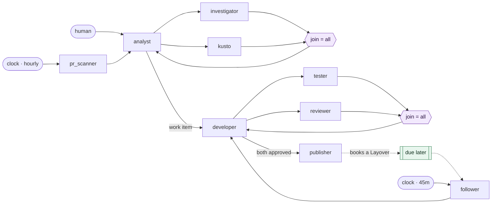

<div align="center">

<picture>
  <source media="(prefers-color-scheme: dark)" srcset="assets/logo-dark.png">
  
</picture>

**A local-first framework for running a lights-out agent factory.**

[](https://github.com/KotkaZ/layover-project/actions/workflows/ci.yml)
[](https://github.com/KotkaZ/layover-project/actions/workflows/pages.yml)
[](https://github.com/KotkaZ/layover-project/actions/workflows/release.yml)
[](https://github.com/KotkaZ/layover-project/releases/latest)
[](LICENSE)

[Documentation](https://kotkaz.github.io/layover-project/) ·
[Install](#install) ·
[Design](docs/architecture.md) ·
[Decisions and open questions](docs/decisions.md)

</div>

> **Status: early implementation.** `layover run` now does real work: it takes what is queued,
> checks each flight against the route map and the safety rails, spawns the agent CLI, watches it,
> bounds it, prices it and writes it down. **What does not exist is the agent-to-agent half** —
> nothing routes a flight from one agent to the next, and there is no MCP server for them to talk
> through, so a chain is one hop long. Detail in [what works today](#what-works-today).
>
> Pre-1.0 and maintained by one person: expect breaking changes on a minor bump. See
> [project status](#project-status).

Layover does not call LLMs. It is a *supervisor*: it spawns headless agent CLIs, gives them a way
to talk to one another, persists what they learn, and stops them from running away.

You describe a factory in a single `layover.toml` — which agents exist, what each one is for,
which agents may trigger which others, and how work gets in. Layover then runs it unattended.

## Install

Layover is a single binary. No Rust toolchain needed.

```sh
# macOS / Linux
curl --proto '=https' --tlsv1.2 -LsSf \
  https://github.com/KotkaZ/layover-project/releases/latest/download/layover-cli-installer.sh | sh

# Windows
powershell -ExecutionPolicy Bypass -c "irm https://github.com/KotkaZ/layover-project/releases/latest/download/layover-cli-installer.ps1 | iex"

# ...or, since you probably already have Node for the agent CLIs
npm i -g https://github.com/KotkaZ/layover-project/releases/latest/download/layover-cli-npm-package.tar.gz
```

> **Not `cargo install layover`.** That is an unrelated SSH tunnelling crate whose binary is also
> called `layover`. Layover is not on crates.io yet; use an installer above or
> `cargo install --path crates/layover-cli` from a clone.

### Download a build

Every release publishes all five targets, plus a `sha256.sum` covering every artifact.

| Platform | Archive |
|---|---|
| Linux x86-64 | [`layover-cli-x86_64-unknown-linux-gnu.tar.xz`](https://github.com/KotkaZ/layover-project/releases/latest/download/layover-cli-x86_64-unknown-linux-gnu.tar.xz) |
| Linux ARM64 | [`layover-cli-aarch64-unknown-linux-gnu.tar.xz`](https://github.com/KotkaZ/layover-project/releases/latest/download/layover-cli-aarch64-unknown-linux-gnu.tar.xz) |
| macOS Apple silicon | [`layover-cli-aarch64-apple-darwin.tar.xz`](https://github.com/KotkaZ/layover-project/releases/latest/download/layover-cli-aarch64-apple-darwin.tar.xz) |
| macOS Intel | [`layover-cli-x86_64-apple-darwin.tar.xz`](https://github.com/KotkaZ/layover-project/releases/latest/download/layover-cli-x86_64-apple-darwin.tar.xz) |
| Windows x86-64 | [`layover-cli-x86_64-pc-windows-msvc.zip`](https://github.com/KotkaZ/layover-project/releases/latest/download/layover-cli-x86_64-pc-windows-msvc.zip) |

All releases: [github.com/KotkaZ/layover-project/releases](https://github.com/KotkaZ/layover-project/releases)

Other options — building from source — are in
[the install guide](https://kotkaz.github.io/layover-project/install.html).

```sh
layover validate --config layover.toml --strict   # check a factory before it runs
layover explain                                   # what can trigger what, and what talks to what
layover prompt tester --flag run_e2e=true         # what an agent would actually be told
```

## The idea

Picture an airport grid.

Each **agent** is an airport. A message is a **Flight**. A chain of flights originating from one
trigger is an **Itinerary**, and it carries the two things that keep the network sane: **Hops**
(how many legs remain) and **Fuel** (how much budget remains). The **Tower** is air traffic
control. One supervised CLI execution is a **Run**; each agent keeps its own notes in its
**Hangar** and shares what everyone should know in the **Logbook**. Work an agent sets down to
pick up later is a **Layover**. When everything needs to stop, you call a **Ground Stop**.

## How it works


- **Sending a message is what starts an agent.** There is no separate spawn step — a flight's
  arrival is what brings an agent to life.
- **Agents talk over MCP.** Layover exposes an MCP server, so Claude Code, Copilot CLI and Codex
  CLI reach it natively with no adapter code.
- **Every run is a clean slate.** Nothing carries over implicitly between runs.
- **Which makes memory explicit.** An agent's continuity is exactly what it chose to write down.
  This is the most opinionated idea in the project, and it is deliberate.
- **The route map is a directed graph.** No edge means the flight is refused.
- **Work enters through pipelines.** Named, triggerable entry points — manual, or on a clock.
- **Prompts compose.** An agent's instructions can pull in extra sections depending on the flags a
  run was triggered with.
- **Runaway swarms are bounded by construction** — every itinerary burns Hops and Fuel, and the
  Tower, not the agent, holds the counters.

## Project status

Maintained by [@KotkaZ](https://github.com/KotkaZ). Contributions welcome — see
[`CONTRIBUTING.md`](CONTRIBUTING.md); vulnerabilities go through
[`SECURITY.md`](SECURITY.md), not the issue tracker.

| | |
|---|---|
| **Stability** | Pre-1.0. A minor bump may break things, and the changelog says when it does. |
| **Versions** | Crate versions track releases of *what is built*. The **first runnable release** — the milestone where a factory actually runs — has not happened yet, and is a goal rather than a version number. |
| **MSRV** | Whatever [`rust-toolchain.toml`](rust-toolchain.toml) pins, currently 1.98. It is the only toolchain tested, so claiming an older one would be a guess. Raised in a minor release. |
| **Platforms** | Developed on Windows, CI on Linux, released for both plus macOS. |
| **Changes** | [`CHANGELOG.md`](CHANGELOG.md) |

## Scope

The first runnable release targets Claude Code, GitHub Copilot CLI and OpenAI Codex CLI, on a
single machine. See [`docs/decisions.md`](docs/decisions.md) for the reasoning, what is still
open, and what is explicitly out of scope.

## Examples

Four factories, smallest first — start at [`examples/`](examples/README.md). `planner.toml` is
three agents in one screen; `workitem-factory/` is the scenario the first runnable release is
sized against.

## The reference factory

[`examples/workitem-factory/`](examples/workitem-factory/README.md) is the largest of them, and
the one worth reading once the format is familiar:



A request is investigated and backed with telemetry, turned into a work item, implemented, then
tested and reviewed in a loop that turns until both agents approve — after which a pull request is
opened. A second, scheduled pipeline reviews open pull requests hourly; a third picks up work the
publisher set down, so a chain can wait days for review comments without holding a process open.
It exercises concurrent fan-out, two rendezvous joins, a loop of unknown length, conditional
prompts, and the hop arithmetic that makes the loop survivable.

## Building

```
cargo xtask verify
```

That is the only definition of done: generated-code freshness, documentation checks, format, lint,
test and doc build, with warnings denied. CI runs the same command, unchanged.

| Crate | What it is |
|---|---|
| `layover-core` | Config, agents, routes, pipelines, prompts, the route graph, validation, itinerary accounting, barriers |
| `layover-http` | The HTTP surface, **generated** from [`api/openapi.yaml`](api/openapi.yaml) |
| `layover-store` | On-disk history and journal: day-segmented JSON Lines, 90-day retention |
| `layover-dashboard` | The monitoring page and the API implementation behind it |
| `layover-tower` | The supervisor — the only crate that starts a process |
| `layover-cli` | The `layover` binary |

## What works today

| Built | Not built |
|---|---|
| `validate`, `explain`, `prompt`, `graph` | Routing: nothing sends a message from one agent to another |
| `serve`: the dashboard and the read endpoints behind it | The MCP server agents would talk to each other through |
| **`run`: drains the queue, authorises each flight against the route map and the rails, spawns it, records it** | Barriers, schedules, and resuming a booked Layover |
| Run history, costs, the Reserve, help requests, learnings, reports | A daemon — `run` drains what is queued and stops |
| `POST /flights`, which queues a trigger durably | Live run streaming and Ground Stop over HTTP, which answer `501` |
| `autostart`, which registers `layover serve` at login | |

**A factory that runs one agent is not yet a mesh.** A human can trigger work and Layover will do
it — authorise it, spawn it, bound it, price it, write it down. What is missing is the agent-to-agent
half: nothing routes a flight from one agent to the next, so a chain is one hop long.

What each remaining piece will do is settled rather than open: see
[`docs/first-release.md`](docs/first-release.md).

## Contributing

Contributions are welcome from humans and from agents, and the rules are the same for both:
[`CONTRIBUTING.md`](CONTRIBUTING.md) is the short version, [`AGENTS.md`](AGENTS.md) the full one.
Vulnerabilities go through [`SECURITY.md`](SECURITY.md) rather than the issue tracker.

### Why the gate matters more than the process

**Verification, not generation, is the bottleneck.** A lights-out factory does not stall because
an agent cannot write code; it stalls because nobody — agent or human — can tell whether the code
is correct without asking someone else. So the repository's most important artifact is a single
command that returns a binary verdict:

```
cargo xtask verify
```

CI runs that exact command and nothing else, so a local pass is a CI pass. That is worth having
whoever is typing: it means a first-time contributor can know their change is acceptable before
opening a pull request, rather than finding out from a review comment three days later.

The same property is what lets this repository be worked on unattended, which it is. Neither use
is at the other's expense.

## License

[Apache-2.0](LICENSE)
