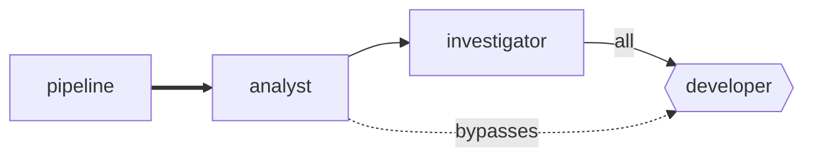

# The dashboard

A factory that runs unattended raises three questions, and they are the three things this page
answers.

- **What is it wired up to do?** The route map, drawn from `layover.toml` as it is on disk.
- **What has it been doing?** Run history, for as long as retention keeps it.
- **What is that costing?** Totals over periods you can actually reason about.

```console
$ layover --config layover.toml serve
Layover dashboard on http://127.0.0.1:7878
Reading layover.toml
History in .layover/history
Press Ctrl+C to stop.
```

## One workflow at a time

A factory holds several pipelines, and they are separate workflows that happen to share agents. A
page that totals them together answers a question nobody asked: "is the build healthy" is about one
of them, and reading it off a combined figure means doing the separation by eye.

The **Workflow** selector in the header scopes the whole page — the route map, runs, cost totals and
breakdowns, and help requests. It defaults to *All workflows*, and it is hidden entirely when a
factory declares only one.

Two things deliberately do not narrow:

| | Why |
|---|---|
| **The Reserve** | It caps the factory. Charging one workflow's spend against a ceiling that covers all of them would report a rail that does not exist. |
| **Learnings** | A learning belongs to an *agent*, and an agent can appear in several workflows. Filtering them by workflow would invent an attribution the model does not have. |

Help requests carry a workflow even though they do not store one: a request records the itinerary
that raised it, an itinerary belongs to exactly one pipeline, and the runs already in the window
supply the mapping. Where retention has taken the run but not the request, the workflow reads as
`—` rather than being guessed at.

## Triggering a workflow

**Trigger a workflow** opens a window with the pipeline, a prompt box, and a switch for every flag
that pipeline declares — each starting from its declared default, so the window shows what would
happen if you changed nothing. A flag the pipeline does not declare is refused rather than ignored:
silently dropping it would let a typo change nothing while appearing to work.

**The work is queued, not started.** Dispatching needs the supervisor, which is not part of this
release, so the flight is persisted and waits. The window says so, and `dispatched_by` is reported
as `null` rather than a plausible name, so a queue never looks like it is moving when nothing is
moving it. A Ground Stop refuses the trigger outright — a kill switch that halts running work while
letting more be booked is not a kill switch.

## Reading what an agent did

Every row on **Runs** opens the report that agent wrote about its own run: a headline, the body,
and the artifacts it produced.

A report is not a transcript. A transcript contains every approach the agent abandoned, and reading
one to find out what happened is slower than doing the work again. Asking the agent to state its
conclusion also makes it decide what its conclusion was.

Reports are capped and trimmed rather than refused — a report is the only account of a run that has
already cost money — and a trimmed one says so, so you know to look further rather than assuming
the agent stopped there. The caps are a 160-character headline, a 12,000-character body and 32
artifacts; a learning is capped at 400 characters, and at most 25 are injected into any one run.

Everything else here is read-only. The operations that genuinely need a running supervisor — streaming a run, engaging a Ground Stop — answer `501` rather than pretending. A control that silently does nothing is worse
than a control that is not there, because it gets trusted once and then relied upon.

It also needs no Tower at all. History outlives the process that wrote it, so the dashboard
answers for a factory that is not currently running — which is exactly when you most want to know
what it did.

## The route map



Read it as: pipelines on the left, work flowing right, one column per hop.

| Drawn as | Means |
|---|---|
| Rounded box | An agent |
| Hexagon | An agent guarded by a rendezvous barrier |
| Thick indigo arrow | A pipeline feeding its entry agent |
| Blue arrow labelled `all` or `any` | An upstream the barrier waits for |
| Dashed violet arrow | A permitted sender the barrier *does not* name |
| Green, amber, red fill | Running, waiting at a barrier, last run failed |

Amber needs the supervisor: nothing records a parked barrier yet, so today the map shows running
and recently-failed agents only.

That dashed arrow is the one worth dwelling on. A barrier constrains only the upstreams it names;
any other permitted sender wakes the agent directly and leaves the parked flights untouched. In
the reference factory the analyst's work item reaches the developer that way, while the tester's
and the reviewer's verdicts queue at the barrier — which is what lets one agent be both a join
target and an ordinary destination.

### One diagram per workflow

A factory usually holds several pipelines, and they are genuinely separate workflows. Drawn
together they read as one very confused process, so each gets its own diagram, stacked down the
page — or just the selected one, when the header narrows the page to it.

Above each diagram is what that workflow has actually been doing: runs and spend over the last
seven days, failures, and open help requests. The diagram says what *may* happen; the strip says
what did, and both questions get asked at the same moment by someone who has just opened the page
wondering whether anything is wrong.

Each carries the rails that bound a chain started there:

| Rail | What it bounds |
|---|---|
| **hops** | **Depth.** Flights before the chain is cut. Branches inherit the count rather than splitting it, so it says nothing about width. |
| **fuel** | **Breadth.** The shared budget, honouring the entry agent''s own `fuel_usd` where it sets one. |
| **workspace** | Whether two instances share a working directory or get one each. |

Both rails are shown together deliberately. Seeing Hops alone invites the assumption that it caps
spending, and it does not — a branching factor of three at `max_hops = 8` permits thousands of
paid invocations while every hop count stays legal.

An agent belonging to two workflows appears in both. That is the honest answer: the developer
really is in the triage pipeline and the follow-up pipeline, and hiding it from one would
misrepresent the factory to make a tidier picture.

Cost gains a **By workflow** table for the same reason. Per-agent totals cannot answer "what does
the nightly sweep cost me" once an agent belongs to more than one.

The diagram is generated per request, so editing `layover.toml` and reloading the page is enough
to see the change. `layover graph` prints the same graph without a server: Mermaid by default for
pasting into a README, `--svg` for the version the dashboard draws.

## Runs

Every supervised execution, newest first, filterable by window, outcome and agent.

| Outcome | Means |
|---|---|
| `running` | Still going |
| `succeeded` | Exited cleanly |
| `failed` | Exited non-zero |
| `timed_out` | Hit `timeout_sec` and was killed |
| `halted` | A rail refused it: Hops, Fuel, the run cap or the Reserve |
| `interrupted` | Alive when the Tower went away — see [Recovery](./recovery.md) |

`halted` is deliberately not coloured like a crash. A rail stopping work is the system doing its
job, and colouring it red teaches people to ignore red.

A run whose cost the runner never reported shows **not reported**, never `$0.00`. The two are
different facts, and the difference decides whether the budget rail is working.

## Cost

Seven windows, of two kinds, and the distinction is part of the answer rather than a detail.

| Window | Kind |
|---|---|
| Today, Month to date | **Calendar** — begins at local midnight |
| Last 24 hours, 7 days, 30 days, 90 days | **Rolling** — a fixed number of hours ending now |
| All time | Everything still kept |

A rolling window is the same length everywhere on earth. A calendar window is not: "this month"
begins at midnight *somewhere*, and the page names the zone it used. Rolling windows say they used
none, and that absence is deliberate — nobody should have to wonder which zone "last 7 days" meant.

Conflating the two is not a theoretical hazard. Gating spend on a UTC day boundary while reporting
the ledger in local time lets a factory spend one day's money twice, and the bug is invisible
until it matters.

Every total carries its provenance, shown next to the figure rather than tucked away:

- *"all measured"* — every run's cost came from the runner.
- *"n of m runs priced from a rate card"* — part of this is an estimate.
- *"n of m runs reported nothing"* — part of this is a hole, and the total is a lower bound.

The weakest source wins. A figure that is 90% measured is still not measured, and saying so is the
entire point of tracking where a number came from.

### The Reserve

Below the window cards is the Reserve: the factory's own ceiling, over its own rolling window.

It is drawn apart from those cards because it answers a different question over a different
period and a different scope. The cards say what something *cost*, over the window you picked,
for the workflow you picked. The Reserve says what may *still be spent*, over the hours
`[reserve] window_hours` names, across every workflow at once.

Putting it among figures that narrow would invite reading it as one of them — and a spending rail
misread as covering less than it does is worse than one not shown at all. It says on its face that
it is not narrowed.

A factory with no `[reserve] fuel_usd`, or one set to `0`, has no ceiling, and the meter is hidden
rather than drawn empty.

## Retention

History is kept for **90 days**, in `.layover/history`, as one JSON Lines file per UTC day.

Retention is applied when `layover serve` starts, not on a timer. A process left running for
months therefore keeps more than ninety days until it is next restarted — the horizon is a floor
on what is kept, not a ceiling.

Deleting is therefore deleting whole files — no rewriting, no compaction, and no window where
history is half-pruned because the process died in the middle of it. A window reaching further
back than 90 days reports a lower bound and says so.

The files are plain text, one JSON object per line, and are meant to be read:

```console
$ tail -1 .layover/history/runs-2026-09-16.jsonl
{"run":"run_01K...","itinerary":"itn_01K...","agent":"developer","pipeline":"development",
 "outcome":"succeeded","started_at":"2026-09-16T10:00:00Z","finished_at":"2026-09-16T10:04:30Z",
 "usd":1.25,"source":"reported","usage":{"input":18402,"output":3100,...}}
```

## Why it looks like this

No npm, no framework, no build step. The page is HTML, CSS and a little vanilla JavaScript,
embedded in the binary, and the graph is SVG generated in Rust.

Three reasons, all pointing the same way. Layover ships as **one binary** to five targets,
installed by people not expected to have a Rust toolchain let alone a Node one. The graph layout
is a **pure function with unit tests**, rather than a 2.5 MB JavaScript dependency whose output
could only be eyeballed. And it has to work **offline**, on a machine left running overnight,
which rules out a CDN.

The choice is reversible: the page only consumes the HTTP API, so replacing it later changes
nothing behind it.
