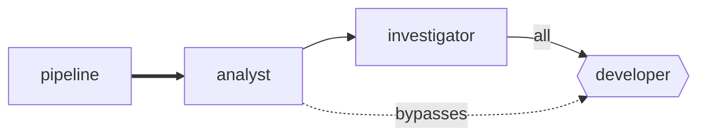

# The dashboard

A factory that runs unattended raises three questions, and they are the three things this page
answers.

- **What is it wired up to do?** The route map, drawn from `layover.toml` as it is on disk.
- **What has it been doing?** Run history, for as long as retention keeps it.
- **What is that costing?** Totals over periods you can actually reason about.

```console
$ layover --config layover.toml serve
Layover dashboard on http://127.0.0.1:7878
Reading layover.toml
History in .layover/history
Press Ctrl+C to stop.
```

It is **read-only**. Nothing here starts, stops or steers work; the operations that would need a
supervisor answer `501` rather than pretending. A control that silently does nothing is worse
than a control that is not there, because it gets trusted once and then relied upon.

It also needs no Tower at all. History outlives the process that wrote it, so the dashboard
answers for a factory that is not currently running — which is exactly when you most want to know
what it did.

## The route map



Read it as: pipelines on the left, work flowing right, one column per hop.

| Drawn as | Means |
|---|---|
| Rounded box | An agent |
| Hexagon | An agent guarded by a rendezvous barrier |
| Thick indigo arrow | A pipeline feeding its entry agent |
| Blue arrow labelled `all` or `any` | An upstream the barrier waits for |
| Dashed violet arrow | A permitted sender the barrier *does not* name |
| Green, amber, red fill | Running, waiting at a barrier, last run failed |

That dashed arrow is the one worth dwelling on. A barrier constrains only the upstreams it names;
any other permitted sender wakes the agent directly and leaves the parked flights untouched. In
the reference factory the analyst's work item reaches the developer that way, while the tester's
and the reviewer's verdicts queue at the barrier — which is what lets one agent be both a join
target and an ordinary destination.

The diagram is generated per request, so editing `layover.toml` and reloading the page is enough
to see the change. `layover graph` prints the same graph without a server: Mermaid by default for
pasting into a README, `--svg` for the version the dashboard draws.

## Runs

Every supervised execution, newest first, filterable by window, outcome and agent.

| Outcome | Means |
|---|---|
| `running` | Still going |
| `succeeded` | Exited cleanly |
| `failed` | Exited non-zero |
| `timed_out` | Hit `timeout_sec` and was killed |
| `halted` | A rail refused it: Hops, Fuel, the run cap or the Reserve |
| `interrupted` | Alive when the Tower went away — see [Recovery](./recovery.md) |

`halted` is deliberately not coloured like a crash. A rail stopping work is the system doing its
job, and colouring it red teaches people to ignore red.

A run whose cost the runner never reported shows **not reported**, never `$0.00`. The two are
different facts, and the difference decides whether the budget rail is working.

## Cost

Seven windows, of two kinds, and the distinction is part of the answer rather than a detail.

| Window | Kind |
|---|---|
| Today, Month to date | **Calendar** — begins at local midnight |
| Last 24 hours, 7 days, 30 days, 90 days | **Rolling** — a fixed number of hours ending now |
| All time | Everything still kept |

A rolling window is the same length everywhere on earth. A calendar window is not: "this month"
begins at midnight *somewhere*, and the page names the zone it used. Rolling windows say they used
none, and that absence is deliberate — nobody should have to wonder which zone "last 7 days" meant.

Conflating the two is not a theoretical hazard. Gating spend on a UTC day boundary while reporting
the ledger in local time lets a factory spend one day's money twice, and the bug is invisible
until it matters.

Every total carries its provenance, shown next to the figure rather than tucked away:

- *"all measured"* — every run's cost came from the runner.
- *"n of m runs priced from a rate card"* — part of this is an estimate.
- *"n of m runs reported nothing"* — part of this is a hole, and the total is a lower bound.

The weakest source wins. A figure that is 90% measured is still not measured, and saying so is the
entire point of tracking where a number came from.

## Retention

History is kept for **90 days**, in `.layover/history`, as one JSON Lines file per UTC day.

Deleting is therefore deleting whole files — no rewriting, no compaction, and no window where
history is half-pruned because the process died in the middle of it. A window reaching further
back than 90 days reports a lower bound and says so.

The files are plain text, one JSON object per line, and are meant to be read:

```console
$ tail -1 .layover/history/runs-2026-09-16.jsonl
{"run":"run_01K...","itinerary":"itn_01K...","agent":"developer","pipeline":"development",
 "outcome":"succeeded","started_at":"2026-09-16T10:00:00Z","finished_at":"2026-09-16T10:04:30Z",
 "usd":1.25,"source":"reported","usage":{"input":18402,"output":3100,...}}
```

## Why it looks like this

No npm, no framework, no build step. The page is HTML, CSS and a little vanilla JavaScript,
embedded in the binary, and the graph is SVG generated in Rust.

Three reasons, all pointing the same way. Layover ships as **one binary** to five targets,
installed by people not expected to have a Rust toolchain let alone a Node one. The graph layout
is a **pure function with unit tests**, rather than a 2.5 MB JavaScript dependency whose output
could only be eyeballed. And it has to work **offline**, on a machine left running overnight,
which rules out a CDN.

The choice is reversible: the page only consumes the HTTP API, so replacing it later changes
nothing behind it.
