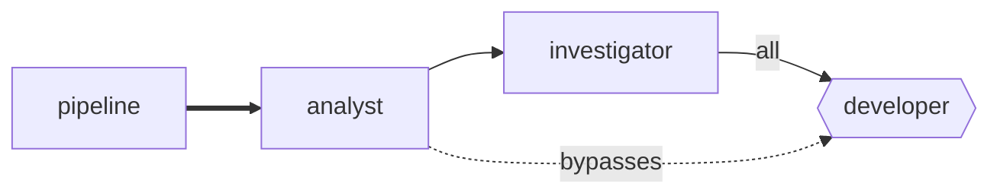

# The dashboard

A factory that runs unattended raises three questions, and they are the three things this page
answers.

- **What is it wired up to do?** The route map, drawn from `layover.toml` as it is on disk.
- **What has it been doing?** Run history, for as long as retention keeps it.
- **What is that costing?** Totals over periods you can actually reason about.

```console
$ layover --config layover.toml serve
Layover dashboard on http://127.0.0.1:7878
Reading layover.toml
History in .layover/history
Press Ctrl+C to stop.
```

## One workflow at a time

A factory holds several pipelines, and they are separate workflows that happen to share agents. A
page that totals them together answers a question nobody asked: "is the build healthy" is about one
of them, and reading it off a combined figure means doing the separation by eye.

The **Workflow** selector in the header scopes the whole page — the route map, runs, cost totals and
breakdowns, and help requests. It defaults to *All workflows*, and it is hidden entirely when a
factory declares only one.

Two things deliberately do not narrow:

| | Why |
|---|---|
| **The Reserve** | It caps the factory. Charging one workflow's spend against a ceiling that covers all of them would report a rail that does not exist. |
| **Learnings** | A learning belongs to an *agent*, and an agent can appear in several workflows. Filtering them by workflow would invent an attribution the model does not have. |

Help requests carry a workflow even though they do not store one: a request records the itinerary
that raised it, an itinerary belongs to exactly one pipeline, and the runs already in the window
supply the mapping. Where retention has taken the run but not the request, the workflow reads as
`—` rather than being guessed at.

## Triggering a workflow

**Trigger a workflow** opens a window with the pipeline, a prompt box, and a switch for every flag
that pipeline declares — each starting from its declared default, so the window shows what would
happen if you changed nothing. A flag the pipeline does not declare is refused rather than ignored:
silently dropping it would let a typo change nothing while appearing to work.

**The work is queued, and the Tower starts it.** Under `layover serve` it starts as soon as a slot
is free, and the window names the Tower that will pick it up. Once it is queued the page opens
[the chain it started](#one-chain-whole), so you watch that run of the workflow rather than the
workflow. Above the workflows a line reads
`2 of 4 run(s) alive · 3 flight(s) queued`, kept current every few seconds — the difference between
a busy factory and a stuck one. A dashboard started with `--watch-only` runs nothing and says so:
`dispatched_by` is `null` rather than a plausible name, so a queue never looks like it is moving
when nothing here is moving it. A Ground Stop refuses the trigger outright — a kill switch that halts running work while
letting more be booked is not a kill switch.

## Watching agents work

**Sessions** shows every run that is going now, and the ones that ended in the last day, each as
its CLI would show it in a terminal: the first lines of what it was asked, its reasoning, every
tool it called with a few lines of what came back, and what it said. Text the model is still
writing appears as it arrives, and is replaced by the finished message. A session that ends says
how — `succeeded`, `failed`, `timed out` — and a finished one replays from the start, which is how
you see the route an agent took to its conclusion rather than only the conclusion.

**Tile running sessions** puts every running session side by side, up to four, and adds new ones as
they start. **Show thinking** hides the reasoning when you only want the actions; **Follow** keeps
each terminal at its latest line. The green number on the tab is how many runs are alive. In
**Runs**, a running row has **Watch** and a finished one **Transcript**; so does a report.

It is **read-only**. There is nowhere to type, and an agent cannot tell it is being watched: the
dashboard reads the transcript the Tower already writes to each run's Hangar, so it works the same
from a `--watch-only` dashboard beside a running `serve`.

What is shown is rendered, not raw. A forty-minute Copilot review writes tens of megabytes, most of
it the same text twice — once token by token, then whole — and the page shows each thing once.
Tool output is cut to its first lines and the prompt to its first two; the whole of both are in the
run's Hangar (`.layover/hangars/<agent>/<run>/`). Credentials are masked the way they are in a
run's failure detail. Copilot CLI's JSON events and Claude Code's `stream-json` are understood;
anything else — Codex, a script — is shown as it was printed.

## Reading what an agent did

Every row on **Runs** opens the report that agent wrote about its own run: a headline, the body,
and the artifacts it produced.

A report is not a transcript. A transcript contains every approach the agent abandoned, and reading
one to find out what happened is slower than doing the work again. Asking the agent to state its
conclusion also makes it decide what its conclusion was.

Reports are capped and trimmed rather than refused — a report is the only account of a run that has
already cost money — and a trimmed one says so, so you know to look further rather than assuming
the agent stopped there. The caps are a 160-character headline, a 12,000-character body and 32
artifacts; a learning is capped at 400 characters, and at most 25 are injected into any one run.

## Stopping it

The **Ground Stop** button is in the header, not behind a tab, because the moment you want it is
the moment you do not want to go looking for it. Pressing it halts everything: running agents are
ended, and no new work starts.

It is a pause, not a stop. Parked work is kept, so engaging a Ground Stop to look at something and
then releasing it resumes where the factory was. Releasing asks for confirmation; engaging does
not — stopping should be easy and starting again should be deliberate, because the cost of a
Ground Stop nobody meant is a pause, and the cost of releasing one somebody did mean is whatever
they engaged it to prevent.

It is a file on disk rather than state in memory, so it survives a crash and can be set by hand
when nothing is responding. The Tower reads it on every pass, so it takes effect within seconds
rather than at the next restart.

Queued work can be cancelled individually. Only work that has *not started*: a run already going
is stopped with a Ground Stop, which is a different decision with a different blast radius — one
flight versus the whole factory — and saying "cancelled" about something still opening pull
requests is the most dangerous thing this surface could say.

The read-only half needs no Tower at all. History outlives the process that wrote it, so the
dashboard answers for a factory that is not currently running — which is exactly when you most
want to know what it did. `layover serve --watch-only` serves that half alone.

## Answering an agent

An agent that cannot get past something raises a **help request** rather than guessing. Those are
in the Help &amp; learnings tab, each with **Reply** and **Resolved**.

**Reply answers it and continues the work.** The window opens with what the agent asked, quoted, so
you can answer between its questions. Sending starts a new run of the agent that asked — a new
chain, with a fresh budget, in the same workflow with the same flags and routes as the chain that
asked. Never the workflow's defaults: a chain that was allowed to open a pull request still is, and
the window says which flags it carries. The agent is told a person sent it, and its work begins with
a line naming the request it answers, then your words exactly as you wrote them:

```text
In reply to your help request run_01M3… (spec needs 3 decisions from Karl)

> 1. Exponential or linear back-off?
Exponential.
```

The request is marked dealt with, recording who replied — the name you give, which the browser
remembers, or the account the dashboard runs as — what you said, and the chain it started. On the
Chains tab each of the two chains names the other. A request filed before Layover recorded its
chain's flags cannot know them, so the window asks you to set them: they start from the workflow's
defaults and it says so, and the reply is refused until it has them.

**Resolved says the blocker is gone**, not *I have read this*. Nothing checks: if it is not actually
fixed, the next run raises it again, which is what keeps the list evidence of something rather than
a queue somebody clears to feel tidy. But a request that *stopped* its run ended its chain, so there
is no next run: resolving one restarts nothing, its button says so, and Reply is the way on.

Learnings sit below them, with `Keep` and `Drop`. **Neither is an approval step.** A learning
applies from the moment an agent proposes it; these say "this is real, stop it lapsing" and "this
is wrong, stop giving it to runs". Dropping asks for confirmation because it takes something out
of every future run; keeping does not, because it only preserves what is already happening.

## Chains

A run is one agent doing one thing. A **chain** is everything one trigger caused, and the budget
they share — Hops, Fuel and the run cap are per chain, so "what did this cost" and "did this
finish" are questions about a chain rather than a run.

| State | Meaning |
|---|---|
| `working` | Something is running, or waiting to |
| `finished` | It ran and stopped, and nothing is outstanding |
| `stalled` | It stopped and nothing will ever happen again |
| `waiting for you` | Its last run stopped to ask you something, and nothing will run until you answer (`awaiting_human`) |
| `halted` | A Ground Stop caught it, or the Reserve refused to start its run |

**`waiting for you` looks finished too.** Every run in it ended cleanly and nothing is queued —
because its last run filed a fatal help request and stopped. It has a **Reply…** beside it and an
amber count on the tab. Resolving the request without replying makes it `finished`; replying makes
it `finished`, continued by the chain the reply started.

**Continue…**, on any chain of a workflow and in a run's report, opens the trigger window with that
workflow chosen and its flags set as that chain had them, saying where they came from. Change them
if you need to. A chain from before runs recorded their flags opens with the workflow's defaults,
and a warning that they are only that.

**`stalled` is the one worth looking for**, and the reason this view exists. A joined agent never
woke because the barrier it was waiting behind could no longer be completed — the tester reported,
the reviewer never did, and the publisher is still waiting for a verdict that is not coming.

Read as a list of runs, that chain looks perfect. Every run says `succeeded`. There is no failed
run to point at and nothing saying the last step never happened. So the Tower writes down the
moment it gives up on a rendezvous, and this is where that shows up:

```text
`publisher` never woke: nothing live could still deliver reviewer
```

A cost with a `+` after it is a floor rather than a figure: some run in the chain reported nothing,
so the real total is at least that much.

A chain is listed from the moment its first flight is queued. Trigger a workflow while every slot
is taken and it reads `working · queued`, with no runs yet, rather than not appearing until a slot
frees; one that is going says where it is — `working · at coder`. Click a chain to see it whole.

## One chain, whole

Trigger a development workflow three times and its route map is still one drawing. It colours the
coder while *any* of the three runs it, so it says that the coder is running and not which of the
three is where. Opening a chain — from **Chains**, from a run's chain in **Runs**, from the buttons
under its workflow's map, or straight after triggering it — shows that chain on its own:

- **Its workflow's map, drawn for it alone.** The same drawing, so the two can be compared at a
  glance, coloured by what happened *in this chain*, with the routes its work actually took drawn
  in green and the rest faded.
- **Every run, in the order it happened**, with who sent it, how it ended, how long it took and
  what it cost, and **Watch** or **Transcript** and **Report** beside each.
- **What it is waiting for**: flights it has queued, at the end of the list.

| Drawn as | Means, in this chain |
|---|---|
| Pale green box | It ran here, and its last run here went well |
| Green box | It is running now |
| Red box | Its last run here failed, timed out, was interrupted or was halted |
| Dashed amber outline | Work for it is queued, waiting for a free slot |
| Faded box | Nothing in this chain reached it |
| Green line | A route this chain's work took |
| `×2` in a corner | It ran twice here — the coder on its second pass after a review, say |

The view keeps itself current every few seconds while the chain works, and stops asking once it
has stopped. Its address ends `#chain=itn_…`, so it survives a reload and can be sent to somebody.

**Sent by** says where each run's work came from: an agent, the `way in` (a trigger, a schedule or a
resumed layover), or `—` when that was not recorded. Runs from before this release, a join restarted
after the Tower that released it went away, and a run the Reserve refused do not know, and they
light no route rather than a guessed one — a route drawn from who happened to run before would look
exactly like one that was taken.

What it cannot show is a flight parked at a barrier: that lives only in the Tower's memory. The
upstreams that have reported show as done, and the joined agent wakes when the last arrives.

## The route map


```mermaid
flowchart LR
  p["pipeline"] ==> a["analyst"]
  a --> b["investigator"]
  b -- all --> c{{"developer"}}
  a -. bypasses .-> c
```

Read it as: pipelines on the left, work flowing right, one column per hop.

| Drawn as | Means |
|---|---|
| Rounded box | An agent |
| Hexagon | An agent guarded by a rendezvous barrier |
| Thick indigo arrow | A pipeline feeding its entry agent |
| Blue arrow labelled `all` or `any` | An upstream the barrier waits for |
| Dashed violet arrow | A permitted sender the barrier *does not* name |
| Line with an arrowhead at each end | A route each way: either agent may send to the other |
| Short line or arc beside a column | A route between two agents in the same column |
| Line under the whole map | A route back towards the way in: out to the right of its column, along a lane of its own, and up into the agent it returns to |
| Arrow labelled with pipeline names | A route only those workflows' chains may use — on the whole-factory map only |
| Green, amber, red fill | Running, waiting at a barrier, last run failed |
| `×2` in a box's corner | Two runs of it alive at once — the workflow triggered twice, say |

Amber needs the supervisor: nothing records a parked barrier yet, so today the map shows running
and recently-failed agents only.

A workflow's map is coloured by that workflow's runs. An agent it shares with another workflow is
not shown running here because the other workflow is running it; a run whose chain no workflow
opened — a review spawned by a sweep, say — could be anybody's, so it counts on every map its agent
is drawn on. Under the map, one button per chain the workflow has going says where each is —
`46TNEG at coder`, `GDTHVD queued for analyst` — and opens [that chain](#one-chain-whole).

That dashed arrow is the one worth dwelling on. A barrier constrains only the upstreams it names;
any other permitted sender wakes the agent directly and leaves the parked flights untouched. In
the reference factory the analyst's work item reaches the developer that way, while the tester's
and the reviewer's verdicts queue at the barrier — which is what lets one agent be both a join
target and an ordinary destination.

Most routes in a real factory come in pairs — an analyst asks an investigator and hears back — so
a pair of plain routes is drawn as **one line with an arrowhead at each end**. Only plain routes
are paired: a join, a spawn, or a scope that differs between the two directions says something the
other direction does not, so each keeps its own arrow. The review loop into a barrier, for
instance, is still drawn out and back.

### What each box says

Under an agent's name is the **model it runs on** and the **reasoning effort** it runs it at, and
under that its **context tier** and whether it is `read-only`:

```text
             bob
claude-opus-5.5 · effort xhigh
        long context
```

The model and its effort share a line because they are one choice: how hard *that* model is asked
to reason. A model name too long to share its line puts the effort at the start of the next, and a
box grows a third small line rather than cut anything off.

All of it is read from the command line Layover will run for that agent — its runner's `command`,
with the agent's own `model` filled in — so a model or effort fixed in the runner is shown as
readily as a model the agent declares. See
[how a runner carries a model](./configuration.md#runners--how-to-invoke-a-cli) for which flags are
read. An agent whose command line names no model or effort is drawn as it always was.

Hover over a box for the rest: its description, runner and access. `GET /agents` reports the same
`model`, `reasoning_effort` and `context` for each agent.

### Tracing one agent

A busy map is easiest to read one agent at a time. **Hover** over an agent — or tab to it — and its
routes and the agents at their other ends stay lit while everything else fades. **Click** it to
keep them lit; a panel opens under that workflow's map with what the agent runs on (model,
effort, context tier, runner, access) and who it **sends to** and **hears from** in this
workflow, with a link to its runs. Click it again, click empty space, or press Escape to let go.
Hovering a single route lights just that route and its two ends, and its tooltip says what it is:
`analyst ⇄ sherlock`, or `azurix → eagle · spawns a new itinerary · only in eagle-eye`.

"In this workflow" is exact: the panel reads the routes drawn on that workflow's map, which are
the routes its chains may use, so an agent shared by two workflows shows different neighbours in
each.

### One diagram per workflow

A factory usually holds several pipelines, and they are genuinely separate workflows. Drawn
together they read as one very confused process, so each gets its own diagram, stacked down the
page — or just the selected one, when the header narrows the page to it.

Above each diagram is what that workflow has actually been doing: runs and spend over the last
seven days, failures, and open help requests. The diagram says what *may* happen; the strip says
what did, and both questions get asked at the same moment by someone who has just opened the page
wondering whether anything is wrong.

Each carries the rails that bound a chain started there:

| Rail | What it bounds |
|---|---|
| **hops** | **Depth.** Flights before the chain is cut. Branches inherit the count rather than splitting it, so it says nothing about width. |
| **fuel** | **Breadth.** The shared budget, honouring the entry agent''s own `fuel_usd` where it sets one. |
| **workspace** | Whether two instances share a working directory or get one each. |

Both rails are shown together deliberately. Seeing Hops alone invites the assumption that it caps
spending, and it does not — a branching factor of three at `max_hops = 8` permits thousands of
paid invocations while every hop count stays legal.

An agent belonging to two workflows appears in both. That is the honest answer: the developer
really is in the triage pipeline and the follow-up pipeline, and hiding it from one would
misrepresent the factory to make a tidier picture.

Each diagram is drawn over the routes **that workflow's chains may use**: every global route, and
every route [scoped](./configuration.md#scoping-a-route-to-workflows) to it. A route scoped to
another workflow is not drawn, and an agent only another workflow's routes reach does not appear.
So a shared agent appears in each workflow with only that workflow's edges — the review sweep's
map does not show the reviewer handing work to the builder when only the build workflow may. In a
factory with no scoped route, every diagram is exactly what it was.

The whole factory in one picture is `GET /graph` without a `pipeline`, or `layover graph`. There
every route is drawn, and an edge only some workflows may use is labelled with their names — in
the SVG it carries a `scoped` class and an "only in …" tooltip. The page itself keeps to one
diagram per workflow, for the reason above.

Cost gains a **By workflow** table for the same reason. Per-agent totals cannot answer "what does
the nightly sweep cost me" once an agent belongs to more than one.

The diagram is generated per request, so editing `layover.toml` and reloading the page is enough
to see the change. `layover graph` prints the same graph without a server: Mermaid by default for
pasting into a README, `--svg` for the version the dashboard draws, and `--pipeline` for one
workflow's diagram.

## Runs

Every supervised execution, newest first, filterable by window, outcome and agent.

| Outcome | Means |
|---|---|
| `running` | Still going |
| `succeeded` | Exited cleanly |
| `failed` | Exited non-zero |
| `timed_out` | Hit `timeout_sec` and was killed |
| `halted` | A rail refused it: Hops, Fuel, the run cap or the Reserve |
| `interrupted` | Alive when the Tower went away — see [Recovery](./recovery.md) |

`halted` is deliberately not coloured like a crash. A rail stopping work is the system doing its
job, and colouring it red teaches people to ignore red.

A run that exited on its own carries its **exit code**. A `failed` one also carries a one-line
`detail`: how the process exited and the line of its output most likely to be the reason —
the last line that says *error* or *failed*, or failing that the last thing it printed:

```text
exited with code 1: Error: Failed to read MCP config file "…\mcp.json": The system cannot find
the path specified.
```

The line is picked, not summarised — Layover calls no model — and it is redacted and capped at
300 characters before it is written, because a transcript is where a CLI that failed to
authenticate prints what it tried. The whole transcript stays in the run's Hangar. Hover a row to
read the detail.

A run whose cost the runner never reported shows **not reported**, never `$0.00`. The two are
different facts, and the difference decides whether the budget rail is working.

## Cost

Seven windows, of two kinds, and the distinction is part of the answer rather than a detail.

| Window | Kind |
|---|---|
| Today, Month to date | **Calendar** — begins at local midnight |
| Last 24 hours, 7 days, 30 days, 90 days | **Rolling** — a fixed number of hours ending now |
| All time | Everything still kept |

A rolling window is the same length everywhere on earth. A calendar window is not: "this month"
begins at midnight *somewhere*, and the page names the zone it used. Rolling windows say they used
none, and that absence is deliberate — nobody should have to wonder which zone "last 7 days" meant.

Conflating the two is not a theoretical hazard. Gating spend on a UTC day boundary while reporting
the ledger in local time lets a factory spend one day's money twice, and the bug is invisible
until it matters.

Every total carries its provenance, shown next to the figure rather than tucked away:

- *"all measured"* — every run's cost was measured: dollars the runner printed.
- *"n of m runs priced from Copilot credits"* — also measured: Copilot reported the AI credits those
  runs used, and they are priced at `[copilot] usd_per_credit`. Named so that the arithmetic stays
  visible.
- *"n of m runs priced from a rate card"* — part of this is an estimate.
- *"n of m runs reported nothing"* — part of this is a hole, and the total is a lower bound.

A total with a hole in it is never shown as a plain figure. It carries a `+` — `$12.40+` — and one
where *every* run reported nothing reads **not reported** rather than `$0.00`, here, in the
breakdowns and in each workflow's **spend, 7d** on the route map. A plain `$0.00` beside runs that
did work is how a factory whose runner prints no cost comes to look free; `layover doctor` says
which runner it is and what to add to its command.

The weakest source wins. A figure that is 90% measured is still not measured, and saying so is the
entire point of tracking where a number came from.

### The Reserve

Below the window cards is the Reserve: the factory's own ceiling, over its own rolling window.

It is drawn apart from those cards because it answers a different question over a different
period and a different scope. The cards say what something *cost*, over the window you picked,
for the workflow you picked. The Reserve says what may *still be spent*, over the hours
`[reserve] window_hours` names, across every workflow at once.

Putting it among figures that narrow would invite reading it as one of them — and a spending rail
misread as covering less than it does is worse than one not shown at all. It says on its face that
it is not narrowed.

A factory whose `[reserve] fuel_usd` is `0` has no ceiling, and the meter is hidden rather than
drawn empty. One that writes no `[reserve]` at all has the default, $100 in any rolling 24 hours.

The meter is the same figure the Tower checks before every run. When it is full, new runs are
refused and their chains show as `halted`, with the reason and the time the window frees room — see
[Cost](./cost.md#what-happens-when-the-reserve-runs-out).

## Retention

History is kept for **90 days**, in `.layover/history`, as one JSON Lines file per UTC day.

Retention is applied when `layover serve` starts, not on a timer. A process left running for
months therefore keeps more than ninety days until it is next restarted — the horizon is a floor
on what is kept, not a ceiling.

Deleting is therefore deleting whole files — no rewriting, no compaction, and no window where
history is half-pruned because the process died in the middle of it. A window reaching further
back than 90 days reports a lower bound and says so.

### What else the horizon reaches

| Path | Holds | Pruned? |
|---|---|---|
| `.layover/history/runs-*.jsonl` | One record per run | Yes, whole files |
| `.layover/journal/help-*.jsonl` | Help requests | Yes, whole files |
| `.layover/hangars/<agent>/run_*/` | A run's prompt and transcript | Yes, whole directories |
| `.layover/hangars/<agent>/memory.md` | What the agent wrote for itself | **No** |
| `.layover/journal/learnings.jsonl` | Confirmed learnings | **No** |

Hangars are pruned by the age encoded in the run's own identifier rather than by the file's
modification time. A run id is a ULID, so it carries the millisecond it was minted; asking the
name is exact, where asking the filesystem is a guess that a copy, a restore or a backup tool
would get wrong.

A directory in a Hangar that Layover did not mint is **left alone**, whatever its age — its age is
unknown, and deleting on a guess is how somebody's own notes disappear.

`memory.md` sits beside those run directories and is never pruned, for the same reason learnings
are not: an agent's accumulated knowledge should not get worse for being old.

> This gap was found by the 48-hour soak, not by a test. Hangars grew without bound while
> everything around them was pruned — and after ninety days a factory held transcripts for runs
> whose records had been deleted, which is evidence attached to nothing.

The files are plain text, one JSON object per line, and are meant to be read:

```console
$ tail -1 .layover/history/runs-2026-09-16.jsonl
{"run":"run_01K...","itinerary":"itn_01K...","agent":"developer","pipeline":"development",
 "outcome":"succeeded","started_at":"2026-09-16T10:00:00Z","finished_at":"2026-09-16T10:04:30Z",
 "usd":1.25,"source":"reported","usage":{"input":18402,"output":3100,...},"exit_code":0,
 "sent_by":["analyst"]}
```

`sent_by` names the agents whose flights started the run — every arrival, for a released join — and
is `[]` for work from outside the mesh. It is absent from records written before it was kept.

## Why it looks like this

No npm, no framework, no build step. The page is HTML, CSS and a little vanilla JavaScript,
embedded in the binary, and the graph is SVG generated in Rust.

Three reasons, all pointing the same way. Layover ships as **one binary** to five targets,
installed by people not expected to have a Rust toolchain let alone a Node one. The graph layout
is a **pure function with unit tests**, rather than a 2.5 MB JavaScript dependency whose output
could only be eyeballed. And it has to work **offline**, on a machine left running overnight,
which rules out a CDN.

The choice is reversible: the page only consumes the HTTP API, so replacing it later changes
nothing behind it.
