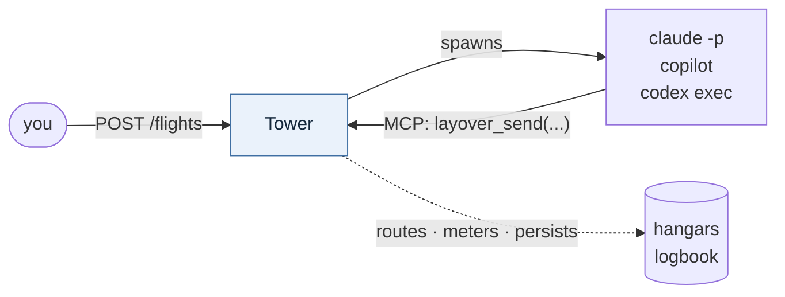

# Layover

**A local-first framework for running a lights-out agent factory.**

Layover does not call LLMs. It is a *supervisor*: it spawns headless agent CLIs, gives them a way
to talk to one another, persists what they learn, and stops them from running away.

You describe a factory in a single `layover.toml` — which agents exist, what each one is for,
which agents may trigger which others, and how work gets in. Layover then runs it unattended.

## The idea

Picture an airport grid.

Each **agent** is an airport. A message is a **Flight**. A chain of flights originating from one
trigger is an **Itinerary**, and it carries the two things that keep the network sane: **Hops**
(how many legs remain) and **Fuel** (how much budget remains). The **Tower** is air traffic
control. One supervised CLI execution is a **Run**; each agent keeps its own notes in its
**Hangar** and shares what everyone should know in the **Logbook**. Work an agent sets down to
pick up later is a **Layover**. When everything needs to stop, you call a **Ground Stop**.

## How it works

- **Sending a message is what starts an agent.** There is no separate spawn step.
- **Agents talk over MCP.** Claude Code, Copilot CLI and Codex CLI reach Layover natively.
- **Every run is a clean slate.** Nothing carries over implicitly between runs, which makes an
  agent's memory exactly what it chose to write down.
- **The route map is a directed graph.** No edge means the flight is refused.
- **Runaway swarms are bounded by construction** — every itinerary burns Hops and Fuel, and the
  Tower, not the agent, holds the counters.

## Status

Early. Everything up to the moment a process would be spawned works: a factory loads, validates
and composes its prompts, and `layover serve` puts a dashboard on it — route map, run history,
cost and the Reserve, help requests, learnings and each agent's report.

**Nothing spawns a process yet.** There is no `layover run`, and no MCP server for agents to talk
to, so a factory is something you can define, inspect and cost rather than something that runs.
A trigger from the dashboard is queued durably and waits.

The [README](https://github.com/KotkaZ/layover-project#what-works-today) carries the built and
not-built list, kept in one place so the two cannot disagree.

## Where to start

- [Install](./install.md)
- [Your first factory](./first-factory.md) — three agents, and the commands that work today
- [The dashboard](./dashboard.md) — `layover serve`, the most useful thing here right now
- [The reference factory](./reference-factory.md) — the shape v0.1 is sized against
