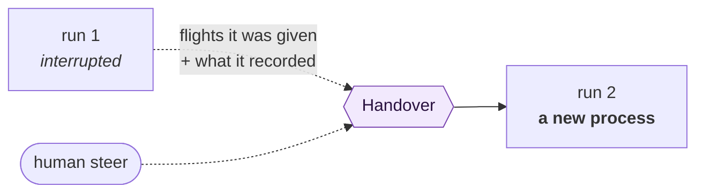

# Recovery and steering

Two problems that turned out to be one.

A run dies when the machine restarts. A human watching a run go the wrong way wants to redirect it.
Both look like they need a process kept alive — resume the conversation, pipe input into the child
— and Layover does neither.

**Instead it starts a new run and hands it what the old one had.**



Nothing is resumed. No session is held open. Every run is still a clean slate *process* — which
keeps the most opinionated decision in the project intact and keeps resident agents, and the
reentrancy hazard they bring, out of scope. What changes is only how much context a new run
**opens** with.

## What a handover carries

| | |
|---|---|
| **Why** | An interruption, or a human's instruction |
| **The flights** | The work item again — the new process remembers nothing |
| **What was recorded** | Whatever the earlier run managed to write down, explicitly not a complete record |

For a restart, the new run is told what happened and warned before repeating anything that changes
the world:

```text
## You are continuing interrupted work

A previous run (run_01ABC) started this work and did not finish: the Tower restarted while it
was running. This is attempt 2.

You are a new process and remember none of it. Before repeating anything that changes the world
— a commit, a comment, a published pull request — check whether the earlier run already did it.
Doing it twice is worse than doing it late.
```

For a steer, the human's instruction is carried with its precedence stated, because steering that
does not override the original request is only a suggestion:

```text
## A human has redirected this work

A previous run (run_01XYZ) was working on this. Their instruction takes precedence over the
original request where the two disagree:

> Use the existing retry helper, do not write a new one.
```

## Recovery is a rail, not a reflex

A recovered or steered run is an **ordinary run**: it spends a hop, debits Fuel, counts against
`max_runs` and draws on the Reserve. A crash loop that restarts itself forever is a fork bomb that
looks like resilience.

```toml
[defaults]
max_recovery_attempts = 2   # 0 disables automatic recovery entirely
```

Restarting is refused when:

| | |
|---|---|
| A **Ground Stop** caused the interruption | A factory that restarts through its own kill switch is not one anybody can stop |
| The attempt limit is reached | See above |
| The agent's policy says not to | See below |

## Doing the work twice is not always safe

```toml
[agents.publisher]
recovery = "manual"
```

| Policy | Meaning |
|---|---|
| `automatic` | Restart without asking, up to the limit. The default. |
| `manual` | Record the interruption and wait for a human to ask. |
| `never` | Do not restart. The itinerary stays interrupted. |

The question is not whether the Tower *can* restart an agent but whether doing its work twice is
safe. Reading and reporting is harmless to repeat. Opening a pull request is not — a run
interrupted after it pushed a branch but before it recorded that it had would, on restart, open a
second one.

There is no reliable way to detect that from the route map: "is terminal and writes" is a
topological guess at a semantic property, and it fires on plenty of factories where repeating is
fine. So Layover does not guess. It does two things instead: the default handover **tells the
agent to check before repeating a side effect**, and `recovery` lets you stop the restart entirely
for the steps where checking is not good enough.

The reference factory sets `recovery = "manual"` on its publisher, and nothing else.

## Status

The domain model, its rails and the handover text are built and tested. Actually detecting an
interruption and starting the replacement needs the Tower, which does not exist yet — see
[the open questions](https://github.com/KotkaZ/layover-project/blob/main/docs/decisions.md).
