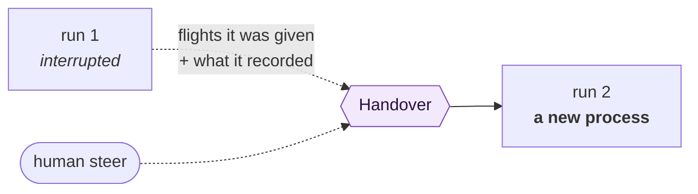

# Recovery and steering

A run can stop before it finishes — the machine restarts, or Layover is shut down while a child
process is still working. And a run going the wrong way sometimes needs a human to redirect it.

Both are handled the same way: **Layover starts a new run and hands it what the old one had.**
Nothing is resumed, and no process is kept alive to be talked to.


```mermaid
flowchart LR
    r1["run 1<br/><i>interrupted</i>"] -. "flights it was given<br/>+ what it recorded" .-> h{{Handover}}
    human([human steer]) -.-> h
    h --> r2["run 2<br/><b>a new process</b>"]

    classDef jn fill:#f2e9fd,stroke:#7a44b0,color:#2a1240
    class h jn
```

Every run is therefore still a clean slate *process*, exactly as an ordinary one is. What a
handover changes is only how much context the new run **opens** with.

## What a handover carries

| | |
|---|---|
| **Why** | An interruption, or a human's instruction |
| **The flights** | The work item again — the new process remembers nothing |
| **What was recorded** | Whatever the earlier run managed to write down, explicitly not a complete record |

For a restart, the new run is told what happened and warned before repeating anything that changes
the world:

```text
## You are continuing interrupted work

A previous run (run_01ABC) started this work and did not finish: the Tower restarted while it
was running. This is attempt 2.

You are a new process and remember none of it. Before repeating anything that changes the world
— a commit, a comment, a published pull request — check whether the earlier run already did it.
Doing it twice is worse than doing it late.
```

For a steer, the human's instruction is carried with its precedence stated, because steering that
does not override the original request is only a suggestion:

```text
## A human has redirected this work

A previous run (run_01XYZ) was working on this. Their instruction takes precedence over the
original request where the two disagree:

> Use the existing retry helper, do not write a new one.
```

## Recovery is a rail, not a reflex

A recovered or steered run is an **ordinary run**: it spends a hop, debits Fuel, counts against
`max_runs` and draws on the Reserve. A crash loop that restarts itself forever is a fork bomb that
looks like resilience.

```toml
[defaults]
max_recovery_attempts = 2   # 0 disables automatic recovery entirely
```

Restarting is refused when:

| | |
|---|---|
| A **Ground Stop** caused the interruption | A factory that restarts through its own kill switch is not one anybody can stop |
| The attempt limit is reached | See above |
| The agent's policy says not to | See below |

## Doing the work twice is not always safe

```toml
[agents.publisher]
recovery = "manual"
```

| Policy | Meaning |
|---|---|
| `automatic` | Restart without asking, up to the limit. The default. |
| `manual` | Record the interruption and wait for a human to ask. |
| `never` | Do not restart. The itinerary stays interrupted. |

The question is not whether the Tower *can* restart an agent but whether doing its work twice is
safe. Reading and reporting is harmless to repeat. Opening a pull request is not — a run
interrupted after it pushed a branch but before it recorded that it had would, on restart, open a
second one.

There is no reliable way to detect that from the route map: "is terminal and writes" is a
topological guess at a semantic property, and it fires on plenty of factories where repeating is
fine. So Layover does not guess. It does two things instead: the default handover **tells the
agent to check before repeating a side effect**, and `recovery` lets you stop the restart entirely
for the steps where checking is not good enough.

The reference factory sets `recovery = "manual"` on its publisher, and nothing else.

## After a restart

A Tower that goes away — a restart, a crash, a closed terminal — leaves a record of every run it
was watching. The next Tower to open the factory, `layover serve` or `layover run`, settles each one
before it starts anything:

1. **It makes sure the process is gone.** A run still alive is cut off — its MCP endpoint and token
   died with the Tower that minted them, so nothing it sends, reports or books can arrive — and is
   stopped along with everything it started. A process identifier since reused by another program
   is recognised by its start time and left alone.
2. **It writes the run to history** as `interrupted`, priced from what its transcript reported, with
   a detail saying what was found.
3. **It restarts the work** where the agent's `recovery` policy and `max_recovery_attempts` allow and
   no Ground Stop is engaged: the same flight, in the same chain, told the handover above. The
   interrupted run's spend is charged to the chain first, so being interrupted cannot buy a chain a
   fresh budget.

```text
`eagle` (run_01M3…) was interrupted by a restart: it was still running, cut off from Layover, and
was stopped; restarted as attempt 2
```

A run another living Tower is watching is left alone. Each Tower holds a lock on a file of its own,
which the operating system releases however the Tower ends, and every run's record names it.
`layover run --dry-run` settles nothing.

A chain's Fuel and run count live in the Tower's memory, so a chain continuing after a restart
starts from its configured budget again — less what the interrupted run spent.

## Status

Recovery after a restart is built on everything above. Steering has its handover, and nothing yet
that lets a person send one.
