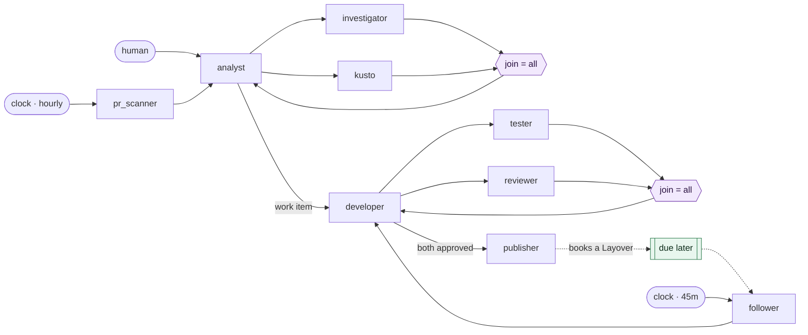

# The reference factory

The scenario Layover is designed and sized against:



A request is investigated and backed with telemetry, turned into a work item, implemented, then
tested and reviewed in a loop that turns until **both** agents approve — after which a pull
request is opened in Azure DevOps. A second, scheduled pipeline reviews open pull requests once
an hour. A third **resumes** work the publisher set down, so a chain can wait days for review
comments without holding a process open.

The full walkthrough, with the hop arithmetic and the reasoning behind each decision, lives beside
the factory itself:

**[examples/workitem-factory/README.md](https://github.com/KotkaZ/layover-project/blob/main/examples/workitem-factory/README.md)**

## Why it is worth reading

It is the smallest factory that exercises everything awkward:

- **Concurrent fan-out** to read-only agents that inspect without clobbering each other.
- **Two rendezvous joins**, both landing on an agent that an ordinary edge also reaches.
- **A loop of unknown length**, which is what makes sizing Hops a real problem rather than a
  formality.
- **Three entry paths** into the same mesh: one manual, one on a clock, one resuming work that was
  deliberately set down.
- **Conditional prompts**, so the tester runs a remote suite only when asked.

## The part people get wrong

The default `max_hops = 8` is enough for this factory's happy path and **not enough for a single
round of rework**. The first rejection would exhaust the chain and leave half-repaired work in
that itinerary's worktree with nothing left to finish it.

That is not a bug in the defaults; it is what happens when a loop meets a depth budget. The
example carries the arithmetic, and a regression test pins it:

```text
flights = 2N + 6   (N test/review cycles, on the longer of the two entry paths)
```

See [Pipelines and triggers](./pipelines.md#sizing-the-rails).
