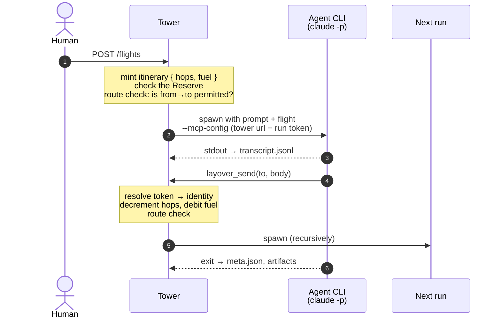

# Architecture

> **Status: design, pre-implementation.** No code exists yet. This document is the canonical
> description of what we intend to build and *why*. Route map semantics, joins and failure paths
> live in [`routing.md`](routing.md); scope and open questions in [`roadmap.md`](roadmap.md);
> known hazards in [`risks.md`](risks.md).

---

## 1. What Layover is

An opinionated, local-first, Rust framework for running a **lights-out agent factory**.

Layover does not call LLMs. It is a **supervisor**. It spawns headless agent CLIs
(`claude -p`, `copilot`, `codex exec`), gives them a way to reach each other, persists what they
learn, and prevents them from running away.

The unit of value is the **route map**: a declarative directed graph of which agents may trigger
which others. The developer designs the factory; the agents run it unattended.

## 2. The metaphor

The vocabulary is drawn from aviation, deliberately and consistently. The canonical glossary is
the terminology table in [`AGENTS.md`](../AGENTS.md) — it is the operational contract and is not
duplicated here.

The metaphor is not decoration. It supplies good names for concepts that otherwise get vague
ones: an *Itinerary* is a far clearer name than "message chain context" for the thing that
carries budget across a causal chain, and *Ground Stop* says exactly what a kill switch does.

## 3. Locked decisions

| Area | Decision |
|---|---|
| Concept | End-to-end framework: runtime, protocol, CLI and UI |
| Language | Rust |
| Deployment | Local-first, single machine |
| Agent execution | Wrap and supervise external headless CLIs |
| Target CLIs (v0.1) | Claude Code, GitHub Copilot CLI, OpenAI Codex CLI |
| Lifecycle | Hybrid — transient per flight, optionally pinned resident |
| Continuity | **Fresh** — every run is a clean slate; nothing is ever resumed |
| Recovery | A new run seeded with a **handover**, never a resumed process |
| Steering | Also a new run, carrying the human's instruction and prior state |
| Spawn vs. send | Unified — sending a flight is what starts an agent |
| Message semantics | Fire-and-forget; `request_response` deferred, superseded by rendezvous joins |
| Re-entry | Reentrant — re-entry spawns a second independent run |
| Concurrency | Unbounded |
| Control channel | **MCP** — Layover is an MCP server, agents are MCP clients |
| Config | A single `layover.toml` |
| Entry points | Named **pipelines**: an entry agent, a trigger (manual or scheduled) and boolean flags |
| Schedules | `every = "1h"` or a five-field cron expression; a one-minute floor, enforced at load |
| Prompts | Inline, or a file that composes others conditionally on a run's flags |
| Agent identity | Name (the table key), a one-line `description`, and a longer `purpose` |
| Per-agent state | Transcript, session ID, self-edited memory, inbox/outbox, run history, artifacts |
| Shared memory | One Markdown **Logbook**; all writes serialized by the Tower |
| Workspace | One shared working directory; contention deliberately unmediated in v0.1 |
| Outside surface | HTTP API with SSE, **generated from `api/openapi.yaml`**; the UI is purely a client |
| Distribution | `dist`-generated installers: shell, PowerShell, npm and prebuilt archives; `cargo install` for those who have it; documentation on GitHub Pages |
| Safety rails | Hops (TTL), Fuel (chain budget), Reserve (factory budget), Ground Stop |
| Hops semantics | One hop per flight; branches inherit the remaining count, so Hops bounds **depth** only |
| Breadth bound | Fuel — required in v0.1, with a deterministic fallback when runners cannot report cost |
| Total bound | **Reserve** — a rolling-window ceiling across every itinerary, because Fuel resets per chain |
| Cost provenance | Every figure is `reported`, `rate_card` or `unreported`; totals carry the weakest of them |
| License | Apache-2.0 |
| Verification | `cargo xtask verify`, run identically by CI |
| Dogfooding | Ship an example factory; never point one at Layover's own source |
| Model shape | **Permission mesh**, not a pipeline engine — agents decide routing |
| Fan-in | Declarative rendezvous joins on the receiving node |
| Failure routing | An ordinary edge; the agent decides, the Tower does not evaluate conditions |
| Join scope | A barrier constrains the upstreams it names; any other permitted sender bypasses it |
| Workspace access | Per-agent `read-only` / `read-write`; read-only agents get a worktree snapshot |
| Reference scenario | [`examples/workitem-factory/`](../examples/workitem-factory/README.md) — the shape v0.1 is sized against |

## 4. Two central insights

### 4.1 Fresh runs make memory explicit

Because nothing carries over implicitly, an agent's continuity is *exactly what it chose to write
down*. `memory.md` is not a cache — it is the agent's entire sense of self across time.

This is the most opinionated idea in the project and should be treated as a headline feature
rather than an implementation detail. It has consequences: agent prompts must make agents
deliberate about what they record, and the Logbook is how a factory accumulates shared
institutional knowledge.

It also cleanly resolves re-entrancy. Two concurrent runs of the same agent share no session
state, so re-entry is safe by construction — *except* for pinned resident agents, which do have a
session to corrupt. See [`risks.md`](risks.md#1-resident--reentrant-conflict).

### 4.2 Identity must come from the Tower, not the agent

This is the load-bearing security decision.

A wrapped CLI is a black box that can emit anything. If a child process could tell Layover
*"I am the planner and I have seven hops left"*, every safety rail would be advisory, and a
confused or adversarial agent could grant itself unlimited budget.

Therefore: **the Tower mints a single-use bearer token per run.** The token — never the agent's
claims — resolves to `(agent_id, itinerary_id)`. Hops and Fuel are held server-side against the
itinerary. The agent cannot read, forge or refresh them.

This is why the MCP server uses `rmcp`'s **streamable HTTP** transport (feature
`transport-streamable-http-server`) rather than stdio: one long-lived authenticated endpoint
inside the Tower, with each child holding its own token. A stdio MCP subprocess per run would
have no way to prove who it is.

## 5. Runtime flow



The token — never the agent's claims — is what resolves to `(agent_id, itinerary_id)`. See §4.2.

## 6. Configuration

A single `layover.toml`.

```toml
[layover]
state_dir = ".layover/state"      # hangars
work_dir  = "workspace"           # the shared working directory
logbook   = ".layover/logbook.md"
http_addr = "127.0.0.1:7878"

[defaults]
runner      = "claude"
max_hops    = 8
fuel_usd    = 5.00
max_runs    = 64
timeout_sec = 900

# ── How to invoke each supported CLI ───────────────────────────────
[runners.claude]
command = ["claude", "-p", "{prompt}", "--output-format", "stream-json"]
mcp     = { flag = "--mcp-config", format = "claude_json" }

[runners.copilot]
command = ["copilot", "-p", "{prompt}", "--allow-all-tools"]
mcp     = { flag = "--mcp-config", format = "claude_json" }

[runners.codex]
command = ["codex", "exec", "{prompt}"]
mcp     = { flag = "-c", format = "codex_toml" }

# ── Agents ─────────────────────────────────────────────────────────
[agents.planner]
runner   = "claude"
model    = "claude-opus-4"
resident = false
entry    = true          # a human may send flights here
prompt   = """
You break incoming goals into concrete tasks and dispatch them.
Record durable conclusions with layover_memory_write.
"""

[agents.coder]
runner = "copilot"
prompt = "You implement the task described in the incoming flight."

[agents.reviewer]
runner   = "codex"
prompt   = "You review work and either approve it or return concrete defects."
fuel_usd = 1.00          # per-agent override

# ── The route map: directed edges ──────────────────────────────────
[[routes]]
from = "planner"
to   = "coder"

[[routes]]
from = "coder"
to   = "reviewer"

[[routes]]
from = "reviewer"
to   = "planner"
```

`mode` may be given explicitly, but `async` is the only value v0.1 accepts; blocking
request/response was superseded by rendezvous joins.

An edge absent from `[[routes]]` means the flight is refused. Direction is explicit:
`planner → coder` does not imply `coder → planner`.

Route validation runs at config load, not at first flight — unknown agent names and unreachable
entry points must fail fast, while a human is still watching.

Edges also carry fan-out, rendezvous joins and failure paths. Those semantics are specified in
[`routing.md`](routing.md).

A factory exercising all of it — intake, a rendezvous back onto the entry agent, a test/review
loop that turns until two agents agree, and a publishing step — is in
[`examples/workitem-factory/`](../examples/workitem-factory/README.md). That is the reference
scenario for v0.1 and the shape the rails are sized against.

## 7. Disk layout

```
.layover/
├── layover.toml
├── logbook.md                   # shared memory; Tower-serialized writes
├── ground-stop                  # presence of this file means everything is halted
└── state/
    └── planner/                 # the hangar
        ├── memory.md            # self-edited long-term memory
        ├── transcript.jsonl     # append-only
        ├── session              # provider session id (resident agents only)
        ├── inbox.jsonl
        ├── outbox.jsonl
        └── runs/
            └── 01JRX.../
                ├── meta.json    # status, exit code, timings, tokens, cost
                ├── stdout.log
                ├── stderr.log
                └── artifacts/
workspace/                       # shared working dir — deliberately unmediated in v0.1
```

Ground Stop is a file rather than in-memory state so that it survives a Tower crash and can be
set by hand when nothing else is responding.

## 8. The Flight envelope

```json
{
  "flight_id":          "flt_01JRX...",
  "itinerary_id":       "itn_01JRX...",
  "from":               "planner",
  "to":                 "coder",
  "mode":               "request_response",
  "body":               "Implement the retry policy described in memory.md",
  "reply_to":           null,
  "hops_remaining":     6,
  "fuel_remaining_usd": 3.42,
  "sent_at":            "2026-09-14T08:49:03Z"
}
```

`hops_remaining` and `fuel_remaining_usd` are **mirrored into the envelope for the transcript
only**. The authoritative values live in the Tower, keyed by `itinerary_id`. See §4.2.

## 9. MCP tool surface

What a wrapped agent can do.

| Tool | Purpose |
|---|---|
| `layover_send(to, body, mode)` | Send a flight. Returns a flight ID, or the reply when `request_response`. |
| `layover_peers()` | Which agents this one may reach, and in which mode. |
| `layover_memory_read()` / `layover_memory_write(content)` | The agent's own `memory.md`. |
| `layover_logbook_read()` / `layover_logbook_append(entry)` | Shared memory; serialized by the Tower. |
| `layover_status()` | Hops and Fuel remaining. |

Two of these matter more than they look:

- `layover_peers()` is how an agent discovers the graph at runtime instead of having the topology
  hard-coded into its prompt. The route map stays the single source of truth.
- `layover_status()` lets a well-behaved agent wind down gracefully as budget runs low, rather
  than being killed mid-thought when it hits zero.

## 10. HTTP surface

The UI is purely a client of this API, so this list bounds what the UI can ever do.

**[`api/openapi.yaml`](../api/openapi.yaml) is the contract, not a description of one.**
`cargo xtask generate-api` turns it into `crates/layover-http/src/generated.rs` — types, the `Api`
trait and the axum router — and `cargo xtask verify` regenerates it and fails if the result
differs. An endpoint that exists in code but not in the specification is impossible; one that
exists in the specification but is not implemented is a compile error.

| Method | Path | Purpose |
|---|---|---|
| `GET` | `/health` | Liveness, version, and whether a Ground Stop is engaged |
| `GET` | `/agents` | Agents plus the route map (the UI's graph view) |
| `GET` | `/pipelines` | Declared pipelines, their triggers and their flags |
| `POST` | `/flights` | Start work — name a pipeline, or an `entry = true` agent |
| `GET` | `/runs` | Runs, live and historical |
| `GET` | `/runs/:id` | One run, including how it ended |
| `GET` | `/runs/:id/stream` | SSE live output |
| `GET` | `/costs` | Spend per agent and per model, with its provenance, plus the Reserve |
| `POST` | `/ground-stop` | Halt everything |
| `DELETE` | `/ground-stop` | Resume |

## 11. Crate layout

```
layover/
├── api/openapi.yaml      # THE HTTP CONTRACT — the server is generated from this
├── book/                 # the published documentation site (mdBook → GitHub Pages)
├── crates/
│   ├── layover-core/     # Agent, Flight, Itinerary, Route, Pipeline, prompts, config, validation
│   ├── layover-http/     # generated types, the Api trait, the axum router
│   ├── layover-cli/      # the `layover` binary
│   ├── layover-store/    # (not built) hangars, logbook, serialized writes, transcripts
│   ├── layover-tower/    # (not built) scheduler, supervision, itinerary accounting, ground stop
│   └── layover-mcp/      # (not built) rmcp server, per-run token auth
├── xtask/                # cargo xtask verify / generate-api / docs
└── ui/                   # later; a plain SPA over the HTTP API
```

Dependencies: `tokio`, `axum`, `rmcp`, `serde`, `toml`, `clap`, `croner`, `tracing`, `ulid`.

The split is not only separation of concerns. Each crate plus its tests should fit inside a single
agent's working context — see §12.

## 12. The repository is itself a factory

Layover is not only *for* agent factories; this repository is built to be worked on by agents.
That is a constraint on the repo, not a style preference.

**The governing principle: verification, not generation, is the bottleneck.** A lights-out factory
does not stall because an agent cannot write code. It stalls because an agent cannot tell whether
its code is correct without asking a human. Every convention in [`AGENTS.md`](../AGENTS.md)
follows from that sentence, and the most important artifact in the repo is one command returning a
binary verdict: `cargo xtask verify`. CI runs it unchanged, which removes the class of failure
where an agent passes locally and CI disagrees — something an unattended factory cannot diagnose.

### Instruction files

`AGENTS.md` is the single authoritative instruction file. As of 2026 it is the primary format for
all three target CLIs; `CLAUDE.md` and `.github/copilot-instructions.md` are legacy fallbacks and
are deliberately **not** maintained here. Three divergent instruction files is three chances to
drift.

### Two tiers of shared knowledge

A distinction that falls out of the design and is worth preserving:

| | `AGENTS.md` | `logbook.md` |
|---|---|---|
| Author | Humans | Agents |
| Lifetime | Version-controlled, durable | Runtime, accumulating |
| Content | How we work here | What we have learned so far |
| Changed via | Reviewed commit | `layover_logbook_append` |

Static context and dynamic memory are different things. Merging them into one file loses the
distinction between *policy* and *findings*.

## 13. Decision log

Rationale for the decisions that are not self-evident. This section exists because there is no
separate ADR trail: an agent opening this repository starts fresh and cannot recover intent from
a diff. Following the project's own philosophy, the reasoning has to be written down somewhere.

**Why supervise CLIs instead of calling LLMs directly.** The agent CLIs already solve tool use,
sandboxing, context management and provider auth. Reimplementing that would be the whole project.
Supervising them means Layover's scope stays orchestration, and it inherits improvements to those
CLIs for free. The cost is that agents become opaque processes, which is what forces §4.2.

**Why MCP is the control channel.** All three target CLIs speak MCP natively, so agents gain the
ability to message each other with no adapter code and no bespoke protocol. This also answered the
open interop question: Layover does not need to pick between A2A, ACP or a greenfield protocol for
v0.1, because the control channel and the integration standard turned out to be the same problem.

**Why sending a message is what starts an agent.** Two operations — spawn and send — would need
two permission models over the same graph, and would allow the incoherent state of an agent
spawned with nothing to do. Unifying them makes the route map the single authority over both
communication and lifecycle.

**Why runs are fresh rather than resumed.** Resumed sessions grow without bound, make cost
unpredictable, and hide what an agent actually knows inside an opaque transcript. Fresh runs force
memory to be deliberate and inspectable. See §4.1.

**Why shared memory is Markdown rather than SQLite.** The Logbook is meant to be read by humans
during an incident and edited by hand when an agent records something wrong. A database would be
more robust and less useful. Write safety is recovered by serializing writes through the Tower
rather than by the storage format.

**Why workspace contention is only partly mediated.** Full locking or per-run worktrees for every
agent are real work and would delay proving the core concept. Read-only agents get a worktree
snapshot, which makes the common fan-out shape safe for free; two concurrent read-write agents
remain unsafe and the risk is recorded in
[`risks.md`](risks.md#2-shared-workspace-contention) rather than forgotten.

**Why fan-in is a join on the receiving node rather than a pipeline definition.** Two edges into
one agent would otherwise fire it twice, on the first arrival rather than the last — duplicate
side effects, silently. A pipeline DSL would fix that by dictating sequence, but it would also
turn the route map from a permission graph into an execution graph and take routing decisions
away from agents. Declaring the barrier on the *receiver* keeps senders free and the mesh
emergent: nobody is told what to do next, a joined agent simply cannot be woken by one input
alone. It also removed the need for blocking `request_response`, because the Tower parks flights
instead of parking processes.

**Why a barrier guards its upstreams rather than its agent.** A join could plausibly mean "this
agent may not run until these inputs arrive". It does not; it means "these inputs reach this agent
together". The difference only shows up when a joined agent is also reachable another way, and
then it decides whether the design works at all: an entry agent that collects results from the
helpers it dispatches would, under the stricter reading, park its own human trigger while waiting
for agents that cannot run until it has been triggered. Deadlock on the first flight. Scoping the
barrier to its declared upstreams also removes the need for an intermediary gate agent in a review
loop — verdicts rendezvous directly on the agent that produced the work, which then decides for
itself whether to loop or move on. The cost is that a run may wake holding less than everything
in flight for it, which is why sender identity is mandatory.

**Why optionality lives in prompts rather than in the route map.** `join = "all"` waits for every
*declared* upstream, so an agent that consults a specialist only when the work calls for one would
strand its own rendezvous — the barrier waits for an agent that was never asked, and the itinerary
stalls on the happy path. Making the barrier wait only for upstreams actually dispatched is the
real fix, and it is deferred rather than dismissed: it requires the Tower to observe dispatch, and
it races, because a fast upstream could release the barrier before its sibling is dispatched at
all. Until then the rule is to dispatch everyone every time and let an idle specialist answer
"nothing to add" — a cheap read-only run in exchange for a barrier that can always be satisfied.

**Why Hops is checked at load time but only weakly.** An agent further from an entry point than
`max_hops` can carry is configured, appears live in the route map, and never runs — worth catching
before the first flight. Plain reachability is not enough on its own, though: a `join = "all"`
target looks close when *any* upstream is close, while it actually waits for the last, so a second
check requires every upstream to be able to afford the flight into the barrier. Both measure
shortest paths, and the budget is really consumed by *loops*: a two-agent review cycle costs two
hops per turn, so a route map three flights deep can need twenty to be useful. Nothing static can
know how many times a loop will turn, so the checks deliberately prove only the negative. The
reference scenario carries the arithmetic instead, and a regression test pins it, because the
default `max_hops = 8` permits that factory's happy path and not one round of rework.

**Why the factory never targets Layover's own source.** It removes an entire class of hazard —
agents editing the supervisor that is running them — and makes it safe to give agents full write
access inside their workspace. The cost is losing the most persuasive dogfooding demo.

**Why the HTTP server is generated from a specification rather than described by one.** A
hand-written server with a hand-written OpenAPI document beside it has two sources of truth and no
force keeping them equal; the document rots first and quietly, because nothing breaks when it
does. Generating the server makes the document load-bearing: a drifted spec is a failing build,
not a stale page. The cost is a generator to maintain, and it is kept cheap by supporting only the
subset this API uses and erroring loudly on anything else — a generator that silently ignored
part of the specification would recreate exactly the problem it was meant to solve.

**Why pipelines are separate from `entry = true`.** They are different things. `entry` is a bare
permission: a human may poke this agent. A pipeline is a *named trigger* that also carries a
schedule and the flags a run is parameterised by. Folding them together would either force every
one-off entry point to declare a pipeline, or leave schedules and flags with nowhere to live.
Keeping pipelines thin — an entry agent, a trigger, some booleans — is what stops them becoming
the pipeline engine the route map deliberately is not.

**Why a schedule may not fire more than once a minute.** A schedule is the only part of Layover
that starts work with nobody present, and runs are reentrant: a schedule that outruns its own work
does not queue, it accumulates concurrent copies. Six-field cron expressions are refused for the
same reason — a seconds field can schedule work faster than a run can finish, which is a fork bomb
with a clock attached. The floor is a minute because that is the finest a five-field expression
can state, so `every` and `cron` agree about what is possible.

**Why prompt composition is conditional rather than templated.** Prompts wanted to vary — a tester
that sometimes runs a remote suite is the same agent with one extra paragraph — and the obvious
answer is string interpolation. Booleans chosen at trigger time are deliberately less powerful:
every possible prompt is a file somebody can read and review, and `layover prompt` can render any
of them exactly as a run would receive it. A templating language would make prompts programs, and
the thing an agent is told would stop being reviewable. The rails around it all exist because the
failure mode is silent: an undeclared flag is an error rather than false, because treating it as
false would let a typo delete a section of instructions without anyone noticing.

**Why prompt flags are checked per entry point rather than per factory.** A run carries the flags
of the one pipeline that triggered it, never the union of every pipeline in the factory. Checking
a prompt against that union looks equivalent and is not: a second pipeline that reaches the same
agent without declaring the flag passes validation and then fails at composition time, hours
later, with nobody watching. So validation walks reachability from *each* entry point and requires
every flag a reachable prompt tests to be declared *there*. The same rule covers a bare
`entry = true` agent, which supplies no flags at all — any conditional prompt downstream of one is
unreachable in practice, and saying so at load time is the whole point.

**Why the overlap warning reads a cron expression's minute field.** A schedule that outruns its
own work accumulates concurrent runs rather than queueing, so the check needs a lower bound on how
often a pipeline can fire. `every` states it outright. Cron does not, but the common footguns —
`* * * * *` and `*/5 * * * *` — state it in the minute field, and reading only those two forms is
enough to catch them. Lists and ranges are deliberately left alone: a wrong lower bound produces a
warning that is not true, and a validator that cries wolf is one people stop reading.

**Why MCP servers are declared per agent rather than left to each CLI.** A telemetry agent needs a
Kusto endpoint and a publisher needs an issue tracker, and configuring those in each CLI's own
settings puts them somewhere the route map cannot see, nothing validates, and no reviewer reads.
Declaring them in `layover.toml` makes an agent's reach part of its definition. The cost is that
config now sits next to credentials, which is why `env` and `env_from` are separate: `env` is for
values safe in a committed file, `env_from` names variables forwarded from the Tower's own
environment, and validation *refuses* a literal whose name looks like a credential. A warning
would not do — the failure is a key in git history, which is not undone by noticing later.

**Why parallel instances needed only a workspace change.** "One pipeline instance per pull
request" sounds like it needs an instance concept, and it does not: every trigger already mints
its own itinerary with its own Hops, Fuel, barriers and flags, because barriers are keyed by
`(itinerary_id, to_agent)` and Fuel is per chain. The single thing instances actually shared was
the working directory. `workspace = "per-itinerary"` gives each a git worktree and the rest was
already true. Left as opt-in because a worktree per itinerary costs disk and setup time, and a
single-instance pipeline wants neither.

**Why autostart generates rather than installs.** A lights-out factory that stops at every reboot
is not lights-out, so the Tower has to survive one. But registering a service writes to the
machine, and the artefact is exactly the kind of thing a person should read before it runs at
every logon. So `layover autostart` renders the platform's own file — Scheduled Task, launchd
agent, systemd user unit — and prints the one command that registers it. It also refuses to write
anything for a factory that does not load, because a service failing at every logon is worse than
no service. All three artefacts install into the logged-in user's session and never machine-wide:
the Tower spawns agents using *that user's* credentials, git identity and workspace, and a system
service would have none of them or would run as root with all of them.

**Why recovery and steering are the same mechanism.** They arrived as different requests — survive
a VM restart, and let a human redirect work in progress — and both looked like they needed a
process kept alive: resume the conversation, or pipe input into the running child. Either would
have made `resident` the normal case and brought back the reentrancy hazard that fresh runs
retired. Starting a *new* run seeded with a **handover** answers both, because what the second run
actually needs is not the first run's process but its context. Nothing is resumed, no session is
held open, and the locked "fresh runs" decision survives intact: a run is still a clean slate
process, it simply opens with more to read.

**Why recovery is bounded like every other rail.** A restarted run spends a hop, debits Fuel,
counts against the run cap and draws on the Reserve, and `max_recovery_attempts` bounds it on top
of all that. A crash loop that restarts itself forever is a fork bomb that looks like resilience.
A Ground Stop is never restarted through, because a factory that restarts past its own kill switch
is not one anybody can stop.

**Why Layover does not guess which agents are unsafe to restart.** Repeating work is harmless for
an agent that reads and reports, and dangerous for one that opened a pull request — a run
interrupted after pushing a branch but before recording it would, on restart, open a second. The
tempting check is "terminal and read-write", and it is a topological guess at a semantic property:
it fires on plenty of factories where repeating is fine, and a validator that cries wolf is one
people stop reading. So the mitigation sits in two better places. The handover text *tells the
agent* to check whether the earlier run already did the thing, which is the only party that can
actually look; and `recovery = "manual"` stops the restart outright for the steps where checking
is not good enough. The reference factory sets it on exactly one agent.

**Why documentation upkeep is in `AGENTS.md` rather than in review.** `docs/` is normative and
hand-maintained, and an agent that trusts a stale document makes confident wrong changes. Review
catches that only if a human remembers to look. So the standing instruction is that every change
carries its documentation, `AGENTS.md` names which file goes with which kind of change, and
`verify` enforces the mechanical part — links that resolve, generated code that matches, examples
that still validate. No tool can check whether a paragraph is still true, which is precisely why
the instruction has to be standing rather than requested.

**Why there is a Reserve as well as Fuel.** Fuel bounds one itinerary, and that turned out not to
bound the factory. A scheduled pipeline mints a *fresh* itinerary — and a fresh Fuel budget — on
every tick, so an hourly pipeline at `fuel_usd = 20` permits `24 × 20 = $480` a day with every
individual chain sitting perfectly inside its rail. The rail was real and the arithmetic still
ran away. The Reserve is the missing axis: a ceiling on total spend that no per-chain budget can
reset.

**Why the Reserve rolls instead of resetting daily.** A daily cap sounds simpler and is worse
twice over. Midnight doubles it — spend the cap at 23:59 and the bucket resets a minute later, so
"$50 a day" permits $100 in two minutes. And a day needs a timezone: a sibling project's daily
gate bucketed by UTC while its ledger bucketed by local time, so between local midnight and the
UTC offset the gate read the wrong day's total and let spending through. "At most $50 in any
rolling 24 hours" has no midnight, no timezone and no daylight-saving edge, and is strictly
stricter.

**Why a cost figure carries where it came from.** A number can be reported by the runner, derived
by Layover from token counts and a rate card, or absent entirely, and those are not
interchangeable. Collapsing them is how a budget quietly becomes fiction: the same sibling project
priced runs from a hand-maintained table and ran **2.7× over actual** — billing one model at `$75`
per million output tokens where the provider charged `$25` — with nothing in the totals saying
"this is a guess". So `CostSource` is a field, not a comment; a total reports the *weakest* source
that fed it, and a summary that is 90% measured still reports as an estimate. For the same reason
Layover ships no rate card: prices change per provider and per context tier, and a stale table
baked into a release is precisely how the drift happens.

**Why the run cap is not the same as a cost rail.** Fuel depends on runners voluntarily reporting
cost and not all of them do, so the deterministic run cap holds when Fuel cannot. What changed is
that the gap is now *countable* rather than a boolean: an itinerary records how many of its runs
went unmetered, so "three of forty" and "all forty" are distinguishable. The first is a gap; the
second means the cost rail is not running at all.

**Why Fuel is required in v0.1 rather than deferred.** Hops was originally assumed to be the
anti-fork-bomb rail. It is not. A hop is spent per flight and branches inherit the remaining
count, so Hops caps how *deep* a chain runs and says nothing about how *wide* it spreads — a
branching factor of 3 at `max_hops = 8` permits thousands of real, paid CLI invocations from a
single trigger. Only a shared per-itinerary budget bounds that, so Fuel moved from "later" to
"required". The follow-on consequence is that Fuel may not depend on runners voluntarily
reporting cost; it needs a deterministic fallback, or the single breadth rail can vanish silently
while still appearing to be enforced.

**Why history is a directory of text files rather than a database.** History is append-only,
written once and read in whole windows — the one shape a query planner is least needed for. The
cost would have been real: `rusqlite` bundles a C library, which means a C cross-compiler for
each of the five targets Layover releases to, trading the musl and aarch64 builds for indexing
that a few megabytes of JSON does not need. Segmenting by day buys three further properties a
single growing file would not: retention becomes deleting files rather than rewriting one, a
window opens only the days inside it, and a partial write — which is what a power cut leaves —
costs one line instead of the file.

**Why the segments are UTC days while the reports are local.** Reporting windows are local
because "this month" is a local question, but a local-day *filename* shifts when the machine
changes zone or the clocks go back: two days would want the same name, or one day would be split
across two files. UTC has no such day. Reading a local window therefore opens one extra segment at
each end and filters by instant — cheap, and it cannot be wrong.

**Why a window is either rolling or calendar, in the type.** "The last 7 days" and "this month"
are asked in the same breath and are not the same kind of question: the first is 168 hours
everywhere on earth, the second begins at a midnight that depends on where the Tower is standing.
Collapsing them is how a factory spends one day's money twice — a sibling project gated on a UTC
boundary while reporting in local time, and for the hours between the two midnights the gate and
the display described different days. So `Window` distinguishes them and every resolved `Span`
carries the zone it was reckoned in, or `None` when there was nothing to reckon. The absence is as
informative as the name.

**Why the dashboard draws its own graph instead of using Mermaid.** Mermaid stays for
`layover graph`, where the output is pasted into a README and portability is the whole point. It
was rejected for the dashboard on weight: the runtime is 2.5 MB of JavaScript that would have to
be vendored into the repository and embedded in the binary to keep the page working offline. A
layered layout for twenty nodes is a few hundred lines that can be unit-tested, where asserting
on a JavaScript library's rendering could not be. Layers come from breadth-first distance rather
than longest path, because route maps are routinely cyclic — the review loop is the point of the
reference factory — and longest-path layering does not terminate on a cycle. Reusing the distance
the validator already computes also means the diagram's columns and the hop arithmetic can never
disagree.

**Why the dashboard refuses control operations instead of hiding them.** Sending a flight,
streaming a run and engaging a Ground Stop all need a supervisor that does not exist yet, and
they answer `501` rather than returning something plausible. A control that silently does nothing
is worse than a control that is not there: it is trusted once, and then relied upon at the moment
it matters.

**Why the prompt is written to stdin and never onto the command line.** The runner template
originally inlined it as `command = ["claude", "-p", "{prompt}", ...]`. Windows caps a command
line at 32,767 characters, and real agent prompts are nowhere near small enough: measured against
a sibling project's prompt trees, its review agent composes to roughly 98 KB — three times over
the limit — and its ordinary developer agent to 34 KB. Two of that project's six agents would not
have started. It is a failure mode that passes every test written against a small fixture and
appears on the first agent worth running, which is the worst shape a bug can have. That project
had already found it the hard way; its runner carries the comment "never `-p` / a shell pipe".
`{prompt}` now substitutes the *path* to the composed instructions, for CLIs that accept one.

**Why recovery requires the previous process to be confirmed gone.** `Interruption` distinguishes
what the Tower *watched* from what it merely *inferred*. A timeout or a non-zero exit means it saw
the process end. A Tower restart or a lost pipe means only that it stopped being able to see one —
and on Windows a child routinely outlives the parent that spawned it. Recovering in that state
starts a second run beside a first that never stopped, which for a publisher means two pull
requests. So those interruptions carry `ChildState::Unknown` until something checks, and
`authorize_recovery` refuses them; the run record keeps the process id so there is something to
check. A recycled process id can make a dead run look alive, which fails towards refusing to
recover — the safe direction, because stalled work is visible and duplicated work is not.

**Why learnings apply immediately instead of waiting for approval.** The obvious design puts a
human between a proposal and its use. A sibling project built exactly that — proposal format,
duplicate detection, impact ratings, a review endpoint, a dashboard queue — and after 22 days of
real operation held 88 learnings, every one still pending, none ever approved. Since only approved
learnings were injected, not one had ever reached a run: everything was built except the step that
creates the value. That is not a discipline failure but an incentive one. Approving buys a diffuse
future benefit, rejecting buys nothing, and ignoring costs nothing today, so a gate whose default
action is free gets defaulted forever. A learning here applies at once and expires after twenty of
its agent's runs, so a wrong one decays rather than compounding, and review happens by exception.
That is only defensible because run history records which learnings were live for each run, which
makes "what was it told when it did that?" answerable and revocation a single press.

**Why an echo does not count as a rediscovery.** Confirmation comes from a learning being
independently arrived at three times, which is evidence — unlike the `impact` rating, which is the
agent's own claim about its own work and therefore decides nothing. The trap is that showing a
learning to an agent contaminates the signal: repeating advice you were just given proves nothing,
and counting it would let a single fluke confirm itself within three runs. So duplicates are
suppressed while a learning is active — the same behaviour the sibling project needed, for the
opposite reason — and only a proposal arriving while the learning has lapsed increments the count.

**Why sameness is decided by containment rather than overlap.** Whether two sentences say the same
thing decides whether rediscovery is ever recognised, and it fails silently in both directions: too
strict and nothing is ever confirmed while the mechanism appears to work, too loose and two
insights merge and one is lost without trace. Word overlap is the wrong measure because real
learnings share sentence frames — "the workspace needs careful handling before publishing" and "the
manifest needs careful handling before publishing" overlap five words out of seven while being
different claims. Containment discriminates correctly: a rediscovery with an added clause is a
superset, while two different insights each carry a word the other lacks. A minimum length stops a
two-word learning matching everything, and a ceiling on elaboration keeps a substantially more
specific claim separate, which is what a refinement is.

**Why help requests are pruned and learnings are not.** Help requests are events: each happened at
a moment, is answered or not, and stops mattering. They are segmented by day and expire on the same
ninety-day horizon as run history. Learnings are state, rewritten as they are rediscovered or
revoked, and exempt from retention entirely — a confirmed learning that expired for being ninety
days old would be the one thing in the system that got worse the longer it was right.

**Why Slots queue where every other rail refuses.** Hops bounds depth, Fuel and the Reserve bound
money, the run cap bounds a chain's total — and none of them bounds how many agent CLIs are alive
at one instant, which is the number that takes a machine down. The gap surfaced by writing a real
pipeline: a scanner dispatching one reviewer per pull request assigned to you has a width nobody
knows until it looks, and fifty assigned pull requests meant fifty simultaneous processes with
every rail satisfied. Slots queue rather than refusing because every other rail protects a budget,
and money spent is gone, whereas a machine that is busy now will not be busy in a minute. Refusing
would turn "review twelve pull requests" into "review four and silently drop eight", which is the
worst available reading of a concurrency limit.

**Why spawning needs a generation counter.** A spawned itinerary gets fresh Hops, fresh Fuel and a
fresh run cap — that is the entire point, because per-item work wants per-item budget. It is also
exactly what makes spawning unbounded: Hops counts depth *within* a chain and cannot see across
chains, so an agent that spawns an agent that spawns an agent recurses forever while every
individual chain stays perfectly inside its rails. Generation is Hops one level up, and it is the
only thing standing between `layover_spawn` and a fork bomb that no existing rail can see.

**Why spawning is a route mode rather than a capability.** The first draft had the scanner call
`layover_spawn` with no route between it and the reviewer, and validation immediately reported the
reviewer as unreachable — correctly, because reachability only knows about routes. The deeper
problem was that `layover_send` is checked against the route map and a free-standing spawn would
not have been: an agent able to open a fresh, fully funded chain into any peer is a larger hole
than one able to send that peer a message. `mode = "spawn"` keeps the route map the single source
of truth for who may reach whom, and makes reachability, the hop check and the diagram all work
without special cases. A route may not both spawn and join, because a barrier waits for upstreams
within one itinerary while a spawn opens one per flight, so every spawned chain would arrive alone
and park forever — silently stalled work rather than an error anybody would see.

**Why a Layover is work set down rather than a chain kept alive.** A chain that publishes a pull
request and then wants to answer the comments arriving on it over the following days had no
expressible shape. Polling spends a hop and real money every tick, so Hops kills it long before a
human replies — and Hops is right to. Re-triggering on a bare schedule works mechanically but
arrives knowing nothing: which work item, what was tried, what the earlier chain concluded. So a
run books a layover, and a resuming pipeline opens a *new* itinerary seeded with a `Handover`.
Nothing stays alive in between — no process, no parked chain, no held budget — which is the same
answer recovery and steering reached, for the same reason: what the later run needs is the earlier
one's context, not its process. Checks back off and eventually expire, because something waiting
on a human who has moved on must stop costing money, and the difference between waiting patiently
and leaking is a count.
