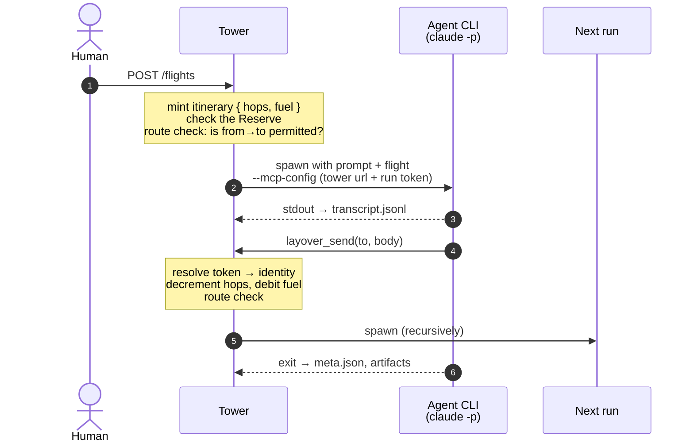

# Architecture

> **Status: see the [README](../README.md).** This document describes the system and *why* it is
> shaped that way, not how much of it is built. Route map semantics, joins and failure paths live
> in [`routing.md`](routing.md); the reasoning and the open questions in
> [`decisions.md`](decisions.md); known hazards in [`risks.md`](risks.md).

---

## 1. What Layover is

An opinionated, local-first, Rust framework for running a **lights-out agent factory**.

Layover does not call LLMs. It is a **supervisor**. It spawns headless agent CLIs
(`claude -p`, `copilot`, `codex exec`), gives them a way to reach each other, persists what they
learn, and prevents them from running away.

The unit of value is the **route map**: a declarative directed graph of which agents may trigger
which others. The developer designs the factory; the agents run it unattended.

## 2. The metaphor

The vocabulary is drawn from aviation, deliberately and consistently. The canonical glossary is
the terminology table in [`AGENTS.md`](../AGENTS.md) — it is the operational contract and is not
duplicated here.

The metaphor is not decoration. It supplies good names for concepts that otherwise get vague
ones: an *Itinerary* is a far clearer name than "message chain context" for the thing that
carries budget across a causal chain, and *Ground Stop* says exactly what a kill switch does.

## 3. Locked decisions

| Area | Decision |
|---|---|
| Concept | End-to-end framework: runtime, protocol, CLI and UI |
| Language | Rust |
| Deployment | Local-first, single machine |
| Agent execution | Wrap and supervise external headless CLIs |
| Target CLIs (v0.1) | Claude Code, GitHub Copilot CLI, OpenAI Codex CLI |
| Lifecycle | Hybrid — transient per flight, optionally pinned resident |
| Continuity | **Fresh** — every run is a clean slate; nothing is ever resumed |
| Recovery | A new run seeded with a **handover**, never a resumed process |
| Steering | Also a new run, carrying the human's instruction and prior state |
| Spawn vs. send | Unified — sending a flight is what starts an agent |
| Message semantics | Fire-and-forget; `request_response` deferred, superseded by rendezvous joins |
| Re-entry | Reentrant — re-entry spawns a second independent run |
| Concurrency | Unbounded |
| Control channel | **MCP** — Layover is an MCP server, agents are MCP clients |
| Config | A single `layover.toml` |
| Entry points | Named **pipelines**: an entry agent, a trigger (manual or scheduled) and boolean flags |
| Schedules | `every = "1h"` or a five-field cron expression; a one-minute floor, enforced at load |
| Prompts | Inline, or a file that composes others conditionally on a run's flags |
| Agent identity | Name (the table key), a one-line `description`, and a longer `purpose` |
| Per-agent state | Transcript, session ID, self-edited memory, inbox/outbox, run history, artifacts |
| Shared memory | One Markdown **Logbook**; all writes serialized by the Tower |
| Workspace | One shared working directory; contention deliberately unmediated in v0.1 |
| Outside surface | HTTP API with SSE, **generated from `api/openapi.yaml`**; the UI is purely a client |
| Distribution | `dist`-generated installers: shell, PowerShell, npm and prebuilt archives; `cargo install` for those who have it; documentation on GitHub Pages |
| Safety rails | Hops (TTL), Fuel (chain budget), Reserve (factory budget), Ground Stop |
| Hops semantics | One hop per flight; branches inherit the remaining count, so Hops bounds **depth** only |
| Breadth bound | Fuel — required in v0.1, with a deterministic fallback when runners cannot report cost |
| Total bound | **Reserve** — a rolling-window ceiling across every itinerary, because Fuel resets per chain |
| Cost provenance | Every figure is `reported`, `rate_card` or `unreported`; totals carry the weakest of them |
| License | Apache-2.0 |
| Verification | `cargo xtask verify`, run identically by CI |
| Dogfooding | Ship an example factory; never point one at Layover's own source |
| Model shape | **Permission mesh**, not a pipeline engine — agents decide routing |
| Fan-in | Declarative rendezvous joins on the receiving node |
| Failure routing | An ordinary edge; the agent decides, the Tower does not evaluate conditions |
| Join scope | A barrier constrains the upstreams it names; any other permitted sender bypasses it |
| Workspace access | Per-agent `read-only` / `read-write`; read-only agents get a worktree snapshot |
| Reference scenario | [`examples/workitem-factory/`](../examples/workitem-factory/README.md) — the shape v0.1 is sized against |

## 4. Two central insights

### 4.1 Fresh runs make memory explicit

Because nothing carries over implicitly, an agent's continuity is *exactly what it chose to write
down*. `memory.md` is not a cache — it is the agent's entire sense of self across time.

This is the most opinionated idea in the project and should be treated as a headline feature
rather than an implementation detail. It has consequences: agent prompts must make agents
deliberate about what they record, and the Logbook is how a factory accumulates shared
institutional knowledge.

It also cleanly resolves re-entrancy. Two concurrent runs of the same agent share no session
state, so re-entry is safe by construction — *except* for pinned resident agents, which do have a
session to corrupt. See [`risks.md`](risks.md#1-resident--reentrant-conflict).

### 4.2 Identity must come from the Tower, not the agent

This is the load-bearing security decision.

A wrapped CLI is a black box that can emit anything. If a child process could tell Layover
*"I am the planner and I have seven hops left"*, every safety rail would be advisory, and a
confused or adversarial agent could grant itself unlimited budget.

Therefore: **the Tower mints a single-use bearer token per run.** The token — never the agent's
claims — resolves to `(agent_id, itinerary_id)`. Hops and Fuel are held server-side against the
itinerary. The agent cannot read, forge or refresh them.

This is why the MCP server uses `rmcp`'s **streamable HTTP** transport (feature
`transport-streamable-http-server`) rather than stdio: one long-lived authenticated endpoint
inside the Tower, with each child holding its own token. A stdio MCP subprocess per run would
have no way to prove who it is.

## 5. Runtime flow



The token — never the agent's claims — is what resolves to `(agent_id, itinerary_id)`. See §4.2.

## 6. Configuration

A single `layover.toml`.

```toml
[layover]
state_dir = ".layover/state"      # hangars
work_dir  = "workspace"           # the shared working directory
logbook   = ".layover/logbook.md"
http_addr = "127.0.0.1:7878"

[defaults]
runner      = "claude"
max_hops    = 8
fuel_usd    = 5.00
max_runs    = 64
timeout_sec = 900

# ── How to invoke each supported CLI ───────────────────────────────
[runners.claude]
command = ["claude", "-p", "{prompt}", "--output-format", "stream-json"]
mcp     = { flag = "--mcp-config", format = "claude_json" }

[runners.copilot]
command = ["copilot", "-p", "{prompt}", "--allow-all-tools"]
mcp     = { flag = "--mcp-config", format = "claude_json" }

[runners.codex]
command = ["codex", "exec", "{prompt}"]
mcp     = { flag = "-c", format = "codex_toml" }

# ── Agents ─────────────────────────────────────────────────────────
[agents.planner]
runner   = "claude"
model    = "claude-opus-4"
resident = false
entry    = true          # a human may send flights here
prompt   = """
You break incoming goals into concrete tasks and dispatch them.
Record durable conclusions with layover_memory_write.
"""

[agents.coder]
runner = "copilot"
prompt = "You implement the task described in the incoming flight."

[agents.reviewer]
runner   = "codex"
prompt   = "You review work and either approve it or return concrete defects."
fuel_usd = 1.00          # per-agent override

# ── The route map: directed edges ──────────────────────────────────
[[routes]]
from = "planner"
to   = "coder"

[[routes]]
from = "coder"
to   = "reviewer"

[[routes]]
from = "reviewer"
to   = "planner"
```

`mode` may be given explicitly, but `async` is the only value v0.1 accepts; blocking
request/response was superseded by rendezvous joins.

An edge absent from `[[routes]]` means the flight is refused. Direction is explicit:
`planner → coder` does not imply `coder → planner`.

Route validation runs at config load, not at first flight — unknown agent names and unreachable
entry points must fail fast, while a human is still watching.

Edges also carry fan-out, rendezvous joins and failure paths. Those semantics are specified in
[`routing.md`](routing.md).

A factory exercising all of it — intake, a rendezvous back onto the entry agent, a test/review
loop that turns until two agents agree, and a publishing step — is in
[`examples/workitem-factory/`](../examples/workitem-factory/README.md). That is the reference
scenario for v0.1 and the shape the rails are sized against.

## 7. Disk layout

```
.layover/
├── layover.toml
├── logbook.md                   # shared memory; Tower-serialized writes
├── ground-stop                  # presence of this file means everything is halted
└── state/
    └── planner/                 # the hangar
        ├── memory.md            # self-edited long-term memory
        ├── transcript.jsonl     # append-only
        ├── session              # provider session id (resident agents only)
        ├── inbox.jsonl
        ├── outbox.jsonl
        └── runs/
            └── 01JRX.../
                ├── meta.json    # status, exit code, timings, tokens, cost
                ├── stdout.log
                ├── stderr.log
                └── artifacts/
workspace/                       # shared working dir — deliberately unmediated in v0.1
```

Ground Stop is a file rather than in-memory state so that it survives a Tower crash and can be
set by hand when nothing else is responding.

## 8. The Flight envelope

```json
{
  "flight_id":          "flt_01JRX...",
  "itinerary_id":       "itn_01JRX...",
  "from":               "planner",
  "to":                 "coder",
  "mode":               "request_response",
  "body":               "Implement the retry policy described in memory.md",
  "reply_to":           null,
  "hops_remaining":     6,
  "fuel_remaining_usd": 3.42,
  "sent_at":            "2026-09-14T08:49:03Z"
}
```

`hops_remaining` and `fuel_remaining_usd` are **mirrored into the envelope for the transcript
only**. The authoritative values live in the Tower, keyed by `itinerary_id`. See §4.2.

## 9. MCP tool surface

What a wrapped agent can do.

| Tool | Purpose |
|---|---|
| `layover_send(to, body, mode)` | Send a flight. Returns a flight ID, or the reply when `request_response`. |
| `layover_peers()` | Which agents this one may reach, and in which mode. |
| `layover_memory_read()` / `layover_memory_write(content)` | The agent's own `memory.md`. |
| `layover_logbook_read()` / `layover_logbook_append(entry)` | Shared memory; serialized by the Tower. |
| `layover_status()` | Hops and Fuel remaining. |

Two of these matter more than they look:

- `layover_peers()` is how an agent discovers the graph at runtime instead of having the topology
  hard-coded into its prompt. The route map stays the single source of truth.
- `layover_status()` lets a well-behaved agent wind down gracefully as budget runs low, rather
  than being killed mid-thought when it hits zero.

## 10. HTTP surface

The UI is purely a client of this API, so this list bounds what the UI can ever do.

**[`api/openapi.yaml`](../api/openapi.yaml) is the contract, not a description of one.**
`cargo xtask generate-api` turns it into `crates/layover-http/src/generated.rs` — types, the `Api`
trait and the axum router — and `cargo xtask verify` regenerates it and fails if the result
differs. An endpoint that exists in code but not in the specification is impossible; one that
exists in the specification but is not implemented is a compile error.

| Method | Path | Purpose |
|---|---|---|
| `GET` | `/health` | Liveness, version, and whether a Ground Stop is engaged |
| `GET` | `/agents` | Agents plus the route map (the UI's graph view) |
| `GET` | `/pipelines` | Declared pipelines, their triggers and their flags |
| `POST` | `/flights` | Start work — name a pipeline, or an `entry = true` agent |
| `GET` | `/runs` | Runs, live and historical |
| `GET` | `/runs/:id` | One run, including how it ended |
| `GET` | `/runs/:id/stream` | SSE live output |
| `GET` | `/costs` | Spend per agent and per model, with its provenance, plus the Reserve |
| `POST` | `/ground-stop` | Halt everything |
| `DELETE` | `/ground-stop` | Resume |

## 11. Crate layout

```
layover/
├── api/openapi.yaml      # THE HTTP CONTRACT — the server is generated from this
├── book/                 # the published documentation site (mdBook → GitHub Pages)
├── crates/
│   ├── layover-core/     # Agent, Flight, Itinerary, Route, Pipeline, prompts, config, validation
│   ├── layover-http/     # generated types, the Api trait, the axum router
│   ├── layover-cli/      # the `layover` binary
│   ├── layover-store/    # (not built) hangars, logbook, serialized writes, transcripts
│   ├── layover-tower/    # (not built) scheduler, supervision, itinerary accounting, ground stop
│   └── layover-mcp/      # (not built) rmcp server, per-run token auth
├── xtask/                # cargo xtask verify / generate-api / docs
└── ui/                   # later; a plain SPA over the HTTP API
```

Dependencies: `tokio`, `axum`, `rmcp`, `serde`, `toml`, `clap`, `croner`, `tracing`, `ulid`.

The split is not only separation of concerns. Each crate plus its tests should fit inside a single
agent's working context — see §12.

## 12. The repository is itself a factory

Layover is not only *for* agent factories; this repository is built to be worked on by agents.
That is a constraint on the repo, not a style preference.

**The governing principle: verification, not generation, is the bottleneck.** A lights-out factory
does not stall because an agent cannot write code. It stalls because an agent cannot tell whether
its code is correct without asking a human. Every convention in [`AGENTS.md`](../AGENTS.md)
follows from that sentence, and the most important artifact in the repo is one command returning a
binary verdict: `cargo xtask verify`. CI runs it unchanged, which removes the class of failure
where an agent passes locally and CI disagrees — something an unattended factory cannot diagnose.

### Instruction files

`AGENTS.md` is the single authoritative instruction file. As of 2026 it is the primary format for
all three target CLIs; `CLAUDE.md` and `.github/copilot-instructions.md` are legacy fallbacks and
are deliberately **not** maintained here. Three divergent instruction files is three chances to
drift.

### Two tiers of shared knowledge

A distinction that falls out of the design and is worth preserving:

| | `AGENTS.md` | `logbook.md` |
|---|---|---|
| Author | Humans | Agents |
| Lifetime | Version-controlled, durable | Runtime, accumulating |
| Content | How we work here | What we have learned so far |
| Changed via | Reviewed commit | `layover_logbook_append` |

Static context and dynamic memory are different things. Merging them into one file loses the
distinction between *policy* and *findings*.

## 13. Where the reasoning lives

Rationale for every decision that was not self-evident, and every question still open, is in
[`decisions.md`](decisions.md). It is kept separate because it grows with every change while
this document describes a system that is meant to settle down.

