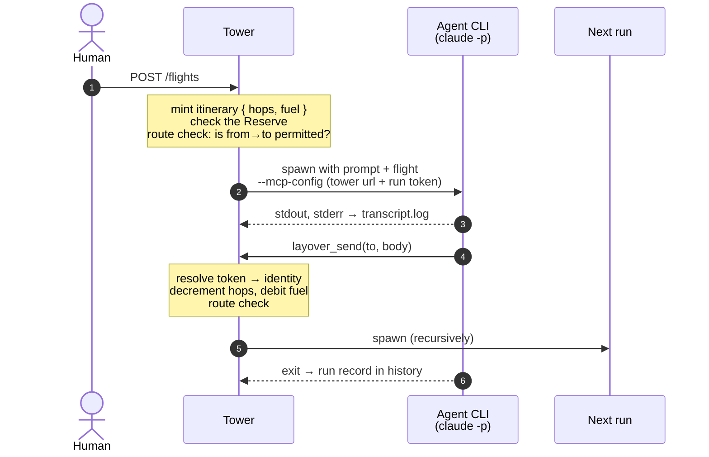

# Architecture

> **Status: see the [README](../README.md).** This document describes the system and *why* it is
> shaped that way, not how much of it is built. Route map semantics, joins and failure paths live
> in [`routing.md`](routing.md); the reasoning and the open questions in
> [`decisions.md`](decisions.md); known hazards in [`risks.md`](risks.md).

---

## 1. What Layover is

An opinionated, local-first, Rust framework for running a **lights-out agent factory**.

Layover does not call LLMs. It is a **supervisor**. It spawns headless agent CLIs
(`claude -p`, `copilot`, `codex exec`), gives them a way to reach each other, persists what they
learn, and prevents them from running away.

The unit of value is the **route map**: a declarative directed graph of which agents may trigger
which others. The developer designs the factory; the agents run it unattended.

## 2. The metaphor

The vocabulary is drawn from aviation, deliberately and consistently. The canonical glossary is
the terminology table in [`AGENTS.md`](../AGENTS.md) — it is the operational contract and is not
duplicated here.

The metaphor is not decoration. It supplies good names for concepts that otherwise get vague
ones: an *Itinerary* is a far clearer name than "message chain context" for the thing that
carries budget across a causal chain, and *Ground Stop* says exactly what a kill switch does.

## 3. Locked decisions

| Area | Decision |
|---|---|
| Concept | End-to-end framework: runtime, protocol, CLI and UI |
| Language | Rust |
| Deployment | Local-first, single machine |
| Agent execution | Wrap and supervise external headless CLIs |
| Target CLIs | Claude Code, GitHub Copilot CLI, OpenAI Codex CLI |
| Lifecycle | Transient per flight; pinning an agent `resident` is declared and not built |
| Continuity | **Fresh** — every run is a clean slate; nothing is ever resumed |
| Recovery | A new run seeded with a **handover**, never a resumed process |
| Steering | Also a new run, carrying the human's instruction and prior state |
| Spawn vs. send | Unified — sending a flight is what starts an agent |
| Message semantics | Fire-and-forget; `request_response` deferred, superseded by rendezvous joins |
| Re-entry | Reentrant — re-entry spawns a second independent run |
| Concurrency | Up to `max_concurrent_runs` runs at once, factory-wide, and `max_concurrent` per agent; the rest queue |
| Control channel | **MCP** — Layover is an MCP server, agents are MCP clients |
| Config | A single `layover.toml` |
| Entry points | Named **pipelines**: an entry agent, a trigger (manual or scheduled) and boolean flags |
| Schedules | `every = "1h"` or a five-field cron expression; a one-minute floor, enforced at load |
| Prompts | Inline, or a file that composes others conditionally on a run's flags |
| Agent identity | Name (the table key), a one-line `description`, and a longer `purpose` |
| Per-agent state | A self-edited `memory.md`; per run, the composed prompt and the CLI's transcript; run records, reports and help requests in history and the journal |
| Shared memory | One Markdown **Logbook**; all writes serialized by the Tower |
| Workspace | One shared working directory; contention not yet mediated — worktrees are designed and not built (risk 2) |
| Outside surface | HTTP API with SSE, **generated from `api/openapi.yaml`**, behind a token minted at start; the UI is purely a client |
| Distribution | `dist`-generated installers: shell, PowerShell, npm and prebuilt archives, each attested; a Homebrew tap; `cargo install layover-cli` for those who have it; documentation on GitHub Pages |
| Safety rails | Hops (TTL), Fuel (chain budget), Reserve (factory budget), Ground Stop |
| Hops semantics | One hop per flight; branches inherit the remaining count, so Hops bounds **depth** only |
| Breadth bound | Fuel, on every chain; the run cap is the deterministic fallback when a runner cannot report cost |
| Total bound | **Reserve** — a rolling-window ceiling across every itinerary, because Fuel resets per chain |
| Cost provenance | Every figure is `reported`, `copilot_credits`, `rate_card` or `unreported`; totals carry the weakest of them |
| License | Apache-2.0 |
| Verification | `cargo xtask verify`, run identically by CI |
| Dogfooding | Ship an example factory; never point one at Layover's own source |
| Model shape | **Permission mesh**, not a pipeline engine — agents decide routing |
| Route scope | A route may name the pipelines whose chains may use it; an unscoped route is global. Still a permission, never an order |
| Fan-in | Declarative rendezvous joins on the receiving node |
| Failure routing | An ordinary edge; the agent decides, the Tower does not evaluate conditions |
| Join scope | A barrier constrains the upstreams it names; any other permitted sender bypasses it |
| Workspace access | Per-agent `read-only` / `read-write`; read-only agents are to get a worktree snapshot — declared, not yet built |
| Reference scenario | [`examples/workitem-factory/`](../examples/workitem-factory/README.md) — everything awkward at once, with the arithmetic that sizes its rails |

## 4. Two central insights

### 4.1 Fresh runs make memory explicit

Because nothing carries over implicitly, an agent's continuity is *exactly what it chose to write
down*. `memory.md` is not a cache — it is the agent's entire sense of self across time.

This is the most opinionated idea in the project and should be treated as a headline feature
rather than an implementation detail. It has consequences: agent prompts must make agents
deliberate about what they record, and the Logbook is how a factory accumulates shared
institutional knowledge.

It also cleanly resolves re-entrancy. Two concurrent runs of the same agent share no session
state, so re-entry is safe by construction — *except* for pinned resident agents, which do have a
session to corrupt. See [`risks.md`](risks.md#1-resident--reentrant-conflict).

### 4.2 Identity must come from the Tower, not the agent

This is the load-bearing security decision.

A wrapped CLI is a black box that can emit anything. If a child process could tell Layover
*"I am the planner and I have seven hops left"*, every safety rail would be advisory, and a
confused or adversarial agent could grant itself unlimited budget.

Therefore: **the Tower mints a bearer token per run**, and revokes it the moment the run ends. The
token — never the agent's claims — resolves to `(agent_id, itinerary_id)`. Hops and Fuel are held
server-side against the itinerary. The agent cannot read, forge or refresh them.

This is why the MCP endpoint is served over **HTTP** from inside the Tower — a small JSON-RPC
handler on `axum`, in `layover-mcp` — rather than over stdio: one long-lived authenticated
endpoint, with each child holding its own token. A stdio MCP subprocess per run would have no way
to prove who it is.

## 5. Runtime flow


```mermaid
sequenceDiagram
    autonumber
    actor Human
    participant Tower
    participant CLI as Agent CLI<br/>(claude -p)
    participant Next as Next run

    Human->>Tower: POST /flights
    Note over Tower: mint itinerary { hops, fuel }<br/>check the Reserve<br/>route check: is from→to permitted?
    Tower->>CLI: spawn with prompt + flight<br/>--mcp-config (tower url + run token)
    CLI-->>Tower: stdout, stderr → transcript.log
    CLI->>Tower: layover_send(to, body)
    Note over Tower: resolve token → identity<br/>decrement hops, debit fuel<br/>route check
    Tower->>Next: spawn (recursively)
    CLI-->>Tower: exit → run record in history
```

The token — never the agent's claims — is what resolves to `(agent_id, itinerary_id)`. See §4.2.

## 6. Configuration

A single `layover.toml`.

```toml
[layover]
work_dir  = "workspace"           # the shared working directory
logbook   = ".layover/logbook.md"
prompt_dir = "prompts"            # what prompt_file paths resolve against

[defaults]
runner      = "claude"
effort      = "medium"    # for agents that set none, where their runner has `{effort}`
max_hops    = 8
fuel_usd    = 5.00
max_runs    = 64
timeout_sec = 900
max_concurrent_runs = 4   # runs alive at once, factory-wide; the rest wait in the queue

# ── How to invoke each supported CLI ───────────────────────────────
# A runner is a CLI and a permission set. `cli` has Layover supply what an unattended run of a CLI
# it knows needs — model, effort and context, no questions, the JSON a cost is read from, MCP — so
# `args` say only what this runner takes away. A CLI with no preset is written out in `command`.
# The prompt goes to stdin, never onto the command line, so none of these name it.
[runners.claude]
cli = "claude"

[runners.copilot]
cli  = "copilot"
args = ["--deny-tool=shell(git push)"]

[runners.codex]
command = ["codex", "exec", "--json", "-c", "model_reasoning_effort={effort}", "{args}", "{mcp}", "-"]
mcp     = { flag = "-c", format = "codex_toml" }

# ── What the whole factory may spend, and how Copilot is priced ────
[reserve]
fuel_usd     = 100.00     # checked before every run; 0 means unlimited
window_hours = 24         # in any rolling 24 hours

[copilot]
usd_per_credit = 0.01     # Copilot reports AI credits, not dollars; this prices them

# ── Agents ─────────────────────────────────────────────────────────
[agents.planner]
runner   = "claude"
model    = "claude-opus-4"
resident = false
entry    = true          # a human may send flights here
prompt   = """
You break incoming goals into concrete tasks and dispatch them.
Record durable conclusions with layover_memory_write.
"""

[agents.coder]
runner  = "copilot"
model   = "claude-opus-5.5"
effort  = "xhigh"        # the agent's own: another agent on this runner can run at another
context = "long_context"
args    = ["--deny-url=api.github.com"]   # added to its runner's, for this agent alone
prompt  = "You implement the task described in the incoming flight."
max_concurrent = 1       # two coders in one working tree would overwrite each other

[agents.reviewer]
runner   = "codex"
prompt   = "You review work and either approve it or return concrete defects."
fuel_usd = 1.00          # per-agent override

# ── The route map: directed edges ──────────────────────────────────
[[routes]]
from = "planner"
to   = "coder"

[[routes]]
from = "coder"
to   = "reviewer"

[[routes]]
from = "reviewer"
to   = "planner"
```

`mode` defaults to `async`, which continues the sender's itinerary; `spawn` opens a new itinerary
per flight, with its own Hops and Fuel — see [`routing.md`](routing.md). Blocking
request/response was superseded by rendezvous joins.

An edge absent from `[[routes]]` means the flight is refused. Direction is explicit:
`planner → coder` does not imply `coder → planner`.

A route may also be scoped to pipelines:

```toml
[[routes]]
from      = "reviewer"
to        = "planner"
pipelines = ["nightly"]   # only chains the nightly pipeline started may use this edge
```

Absent, a route is global — every chain may use it, which is what every route meant before scopes
existed. Present, only chains belonging to one of those pipelines may. A chain belongs to the
pipeline whose trigger started its work: a spawned chain inherits it, a resumed layover belongs to
the resuming pipeline but is held to what its booking chain could reach, and a flight sent
straight to an `entry = true` agent belongs to none and uses global routes only. The Tower records
which pipeline a chain belongs to; no agent can name one. See
[`routing.md`](routing.md#8-scoping-routes-to-workflows).

Route validation runs at config load, not at first flight — unknown agent names and unreachable
entry points must fail fast, while a human is still watching.

Edges also carry fan-out, rendezvous joins and failure paths. Those semantics are specified in
[`routing.md`](routing.md).

A factory exercising all of it — intake, a rendezvous back onto the entry agent, a test/review
loop that turns until two agents agree, and a publishing step — is in
[`examples/workitem-factory/`](../examples/workitem-factory/README.md). That is the reference
scenario, and the shape the rails are sized against.

## 7. Disk layout

Everything a factory accumulates lives in `.layover/`, beside its `layover.toml`:

```
.layover/
├── version.json                 # the layout version: a newer one is refused, an older one migrated
├── ground-stop                  # presence of this file means everything is halted
├── logbook.md                   # shared memory (the default path); Tower-serialized writes
├── history/
│   └── runs-2026-09-23.jsonl    # one record per run, segmented by UTC day
├── journal/
│   ├── pending.jsonl            # the queue
│   ├── layovers.jsonl           # work set down to be resumed later
│   ├── learnings.jsonl          # what agents proposed, and what became of it
│   ├── help-2026-09-23.jsonl    # help requests, segmented by day
│   ├── reports-2026-09-23.jsonl # what each run said it concluded
│   ├── stalls-2026-09-23.jsonl  # barriers given up as unreachable
│   └── skips-2026-09-23.jsonl   # scheduled ticks that came due and did not start
├── state/
│   └── runs/
│       ├── run_01JRX....json    # a live run: written before it spawns, removed once recorded
│       └── owners/              # which Tower is alive, so another leaves its runs alone
└── hangars/
    └── planner/                 # the Hangar
        ├── memory.md            # self-edited long-term memory
        └── run_01JRX.../
            ├── prompt.md        # exactly what the run was told
            ├── transcript.log   # everything its CLI printed
            └── mcp.json         # how it reaches Layover (mcp.toml for Codex)
workspace/                       # the shared work_dir — not yet isolated per agent
```

Day-segmented files and run directories are pruned after 90 days; `memory.md`, `learnings.jsonl`
and the queue are not.

Ground Stop is a file rather than in-memory state so that it survives a Tower crash and can be
set by hand when nothing else is responding.

## 8. The Flight envelope

```json
{
  "id":             "flt_01JRX...",
  "itinerary":      "itn_01JRX...",
  "from":           { "agent": "planner" },
  "to":             "coder",
  "body":           "Implement the retry policy described in memory.md",
  "hops_remaining": 6,
  "sent_at":        "2026-09-14T08:49:03Z"
}
```

`from` is `{ "agent": … }` for a flight an agent sent, and `"human"` for work from outside the mesh,
with a `via` naming a schedule or a resumed layover where one sent it. A queued flight is wrapped
with the pipeline that opened its chain, the flags it runs with, and what the person who triggered
it chose: the chain's name, and agents to run at a different model, effort or context.

`hops_remaining` is **mirrored into the envelope for the transcript only**, and Fuel is not carried
at all. The authoritative values live in the Tower, keyed by the itinerary. See §4.2.

## 9. MCP tool surface

What a wrapped agent can do.

| Tool | Purpose |
|---|---|
| `layover_send` | Send a flight. The only way work moves; returns its flight ID. |
| `layover_peers` | Which agents this one may reach, and what each is for. |
| `layover_status` | Hops and Fuel remaining. |
| `layover_memory_read` / `layover_memory_write` | The agent's own `memory.md`. |
| `layover_logbook_append` | Shared memory, stamped with who wrote it; serialized by the Tower. |
| `layover_report` | What the run concluded — the account of it that survives it. |
| `layover_help` | Something is in the way, and which kind of thing. |
| `layover_learn` | Something future runs should know; lapses unless rediscovered. |
| `layover_wait` | Set work down, to be picked up by a pipeline that resumes layovers. |

Each is described for agents in [Agent tools](../book/src/tools.md).

Two of these matter more than they look:

- `layover_peers()` is how an agent discovers the graph at runtime instead of having the topology
  hard-coded into its prompt. The route map stays the single source of truth.
- `layover_status()` lets a well-behaved agent wind down gracefully as budget runs low, rather
  than being killed mid-thought when it hits zero.

## 10. HTTP surface

The UI is purely a client of this API, so this list bounds what the UI can ever do.

**[`api/openapi.yaml`](../api/openapi.yaml) is the contract, not a description of one.**
`cargo xtask generate-api` turns it into `crates/layover-http/src/generated.rs` — types, the `Api`
trait and the axum router — and `cargo xtask verify` regenerates it and fails if the result
differs. An endpoint that exists in code but not in the specification is impossible; one that
exists in the specification but is not implemented is a compile error.

| Method | Path | Purpose |
|---|---|---|
| `GET` | `/health` | Liveness, version, and whether a Ground Stop is engaged |
| `GET` | `/agents` · `/pipelines` · `/graph` | What the factory is made of, and its route map drawn |
| `POST` · `GET` · `DELETE` | `/flights` · `/flights/:id` | Queue work, see what is waiting, cancel what has not started |
| `GET` | `/upcoming` | What starts on its own: scheduled ticks by the Tower's clock, layovers and when each is picked up, skipped ticks |
| `GET` | `/itineraries` · `/itineraries/:id` | Chains, and one chain whole with its runs and its map |
| `GET` | `/runs` · `/runs/:id` · `/runs/:id/report` | Runs, live and historical, and what each concluded |
| `GET` | `/runs/:id/stream` | SSE: a run's CLI output, rendered — live, or a replay once it is over |
| `GET` | `/costs` | Spend per agent, model and workflow, with its provenance, plus the Reserve |
| `GET` · `POST` | `/help` · `/help/resolve` · `/help/reply` | Help requests; mark them dealt with, or answer and continue the work |
| `GET` · `PATCH` | `/learnings` · `/learnings/:id` | Learnings; keep one for good or stop using it |
| `POST` · `DELETE` | `/ground-stop` | Halt everything; resume |

Parameters and shapes are in the specification and in [HTTP API](../book/src/http-api.md).

## 11. Crate layout

```
layover/
├── api/openapi.yaml      # THE HTTP CONTRACT — the server is generated from this
├── book/                 # the published documentation site (mdBook → GitHub Pages)
├── crates/
│   ├── layover-core/     # Agent, Flight, Itinerary, Route, Pipeline, prompts, config, validation
│   ├── layover-http/     # generated types, the Api trait, the axum router
│   ├── layover-store/    # history, the journal, Hangars, live-run records, retention
│   ├── layover-mcp/      # the MCP endpoint agents call back into, per-run token auth
│   ├── layover-tower/    # the supervisor: clock, dispatch, rails, recovery, ground stop
│   ├── layover-dashboard/# the monitoring page and the Api implementation behind it
│   └── layover-cli/      # the `layover` binary
├── examples/             # five factories, parsed and validated by the test suite
└── xtask/                # cargo xtask verify / generate-api / docs
```

The dashboard is HTML, CSS and plain JavaScript embedded in `layover-dashboard`; there is no
separate UI build. Dependencies are few on purpose: `tokio`, `axum`, `futures-util`, `serde`,
`serde_json`, `toml`, `clap`, `croner`, `jiff`, `ulid`, `thiserror`.

The split is not only separation of concerns. Each crate plus its tests should fit inside a single
agent's working context — see §12.

## 12. The repository is itself a factory

Layover is not only *for* agent factories; this repository is built to be worked on by agents.
That is a constraint on the repo, not a style preference.

**The governing principle: verification, not generation, is the bottleneck.** A lights-out factory
does not stall because an agent cannot write code. It stalls because an agent cannot tell whether
its code is correct without asking a human. Every convention in [`AGENTS.md`](../AGENTS.md)
follows from that sentence, and the most important artifact in the repo is one command returning a
binary verdict: `cargo xtask verify`. CI runs it unchanged, which removes the class of failure
where an agent passes locally and CI disagrees — something an unattended factory cannot diagnose.

### Instruction files

`AGENTS.md` is the single authoritative instruction file. As of 2026 it is the primary format for
all three target CLIs; `CLAUDE.md` and `.github/copilot-instructions.md` are legacy fallbacks and
are deliberately **not** maintained here. Three divergent instruction files is three chances to
drift.

### Two tiers of shared knowledge

A distinction that falls out of the design and is worth preserving:

| | `AGENTS.md` | `logbook.md` |
|---|---|---|
| Author | Humans | Agents |
| Lifetime | Version-controlled, durable | Runtime, accumulating |
| Content | How we work here | What we have learned so far |
| Changed via | Reviewed commit | `layover_logbook_append` |

Static context and dynamic memory are different things. Merging them into one file loses the
distinction between *policy* and *findings*.

## 13. Where the reasoning lives

Rationale for every decision that was not self-evident, and every question still open, is in
[`decisions.md`](decisions.md). It is kept separate because it grows with every change while
this document describes a system that is meant to settle down.

