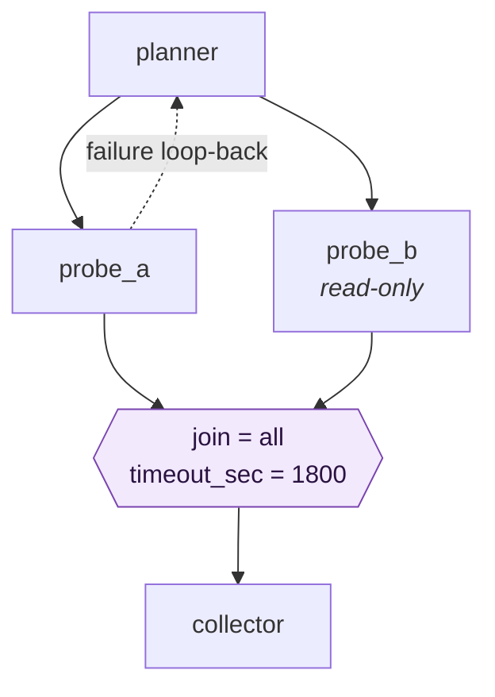

# Routing

How flights move between agents: the route map, rendezvous joins, and failure paths.

> Layover is a **permission mesh**, not a pipeline engine. The route map says who *may* send to
> whom. It does not say what happens next — agents decide that. Everything below preserves that
> property.

---

## 1. Edges

```toml
[[routes]]
from = "planner"
to   = "coder"
mode = "async"
```

Direction is explicit: `planner → coder` does not imply the reverse. An edge absent from
`[[routes]]` means the flight is refused. Validation runs at config load, so unknown agent names
and unreachable entry points fail while a human is still watching.

## 2. Fan-out

An agent may send to several peers in one run. They spawn concurrently:

```toml
[[routes]]
from = "planner"
to   = ["probe_a", "probe_b"]
```

Nothing about this is special — it is two ordinary flights.

**Hops does not restrain a fan-out.** A flight costs one hop, and branches inherit the remaining
count rather than splitting it, so Hops bounds *depth* only. With `max_hops = 8` and a branching
factor of 3, one trigger permits up to 3⁸ ≈ 6,500 runs. **Fuel is what bounds breadth**, which is
why it is a requirement rather than a later refinement — see
[`decisions.md`](decisions.md#why-fuel-is-not-optional).

## 3. Rendezvous joins

Some agents should not wake until several inputs have arrived.

```toml
[[routes]]
from        = ["probe_a", "probe_b"]
to          = "collector"
join        = "all"        # all | any
timeout_sec = 1800
```

The Tower holds a **barrier** keyed by `(itinerary_id, to_agent)`. Flights arriving for a joined
agent are parked rather than delivered. Once the condition is met the target spawns **once**,
receiving all parked flights as its input.

### Why this is still a mesh

The join is a property of the *receiving node*, not a workflow definition. No agent is told what
to do next, and no sequence is enforced. The collector simply cannot be woken by one input alone.
Senders stay free; receivers declare what they need in order to be useful.

This matters because without a join, two edges into one agent make that agent fire **twice** —
and the first firing happens when the *fastest* branch finishes, not when the work is done.
Duplicate side effects are the usual result.

### What a barrier does and does not guard

**Rule: a barrier constrains the upstreams it names and nobody else.** A flight from any other
permitted sender — including a human at an entry point — bypasses the barrier entirely, wakes the
agent on its own, and leaves parked state untouched.

A join declares *which inputs an agent needs together*, not *when an agent is allowed to run*. The
other reading, where a barrier gates every inbound edge, breaks the common case: an agent that
both takes work from a human and collects results from the helpers it dispatches would park its
own trigger, waiting for agents that cannot run until it does.

This is what makes a review loop cheap to express. Verdicts from a tester and a reviewer can
rendezvous directly on the agent that produced the work, which then decides for itself whether to
loop or move on — no intermediary gate agent, and the work item that started it still arrives
normally. See [`examples/workitem-factory/`](../examples/workitem-factory/README.md).

The residual sharp edge: a direct flight can wake an agent while a barrier for that same agent
still holds a partial rendezvous. That is intended — they are independent causes — but the run
that wakes must not assume it is seeing everything. Sender identity is how it tells.

### Abandoning a barrier

A parked barrier that can never complete would hang an itinerary forever, holding work that no
one will collect. Hops does not help, because nothing is flying.

The Tower resolves this by **reachability** rather than by timeout alone: it knows every live run
in the itinerary and the route graph, so it can determine whether any live run could still reach
the barrier. If none can, the barrier is abandoned immediately and the itinerary is marked
*stalled*.

`timeout_sec` remains a backstop for a run that is alive but has wandered off.

**Stalled must be a distinct, visible outcome from failed.** A lights-out factory that quietly
parks work forever is worse than one that crashes.

### Barrier reset

**Rule: a barrier resets when any upstream delivers a second time.** Partial state is discarded,
and every upstream must deliver again.

This exists because of the failure loops in §4. If an upstream re-runs and produces a new result,
a stale result from a *sibling* branch must not be allowed to satisfy the barrier — the collector
would otherwise act on a mixture of old and new state, which looks like success and is not.

The rule carries a constraint: **a loop-back must re-dispatch the whole fan-out, not just the
branch that failed.** Re-sending to only one upstream leaves the barrier waiting for a sibling
that never comes, until reachability analysis abandons it. This currently relies on agent prompts,
which is fragile — see [`risks.md`](risks.md).

### A join has no optional upstreams

`join = "all"` means *every* declared upstream, which rules out the shape that looks most natural
for an agent gathering help: dispatch to one specialist, or two, depending on what the work needs.
Skip a dispatch and the barrier waits for an agent that was never asked, until reachability
analysis abandons it and the itinerary is marked stalled. The happy path becomes a failure.

Until dispatch-aware barriers exist — see [`decisions.md`](decisions.md) — **optionality belongs in
prompts, not in the route map.** Dispatch every upstream every time, and let a specialist with
nothing to contribute reply *"nothing to add, here is why"*. That reply is not waste: it is what
releases the rendezvous, and it records the fact that the question was asked and answered.

## 4. Failure paths

Failure routing is an ordinary edge. Nothing special is required from the Tower, which is what
keeps the mesh intact:

```toml
[[routes]]
from = "probe_a"
to   = "planner"      # something went wrong, hand it back
mode = "async"
```

The sending agent decides which edge to take based on its own result. **Layover does not evaluate
conditions — agents do.** The route map only guarantees that both destinations are permitted.

Because runs are fresh, the flight body must carry enough context for the receiving agent to act.
The agent that wakes is not the agent that did the earlier work and remembers nothing of it. This
is the cost of explicit memory, and prompts must account for it.

## 5. Workspace access

```toml
[agents.probe_b]
access = "read-only"     # read-only | read-write (default)
```

Read-only agents receive a **git worktree at the current commit** rather than the live shared
workspace. This is real enforcement rather than an advisory flag, and it solves a second problem
at the same time: an agent reading the tree while a sibling writes to it would otherwise be
working against a moving target.

This makes the common fan-out shape safe — several agents inspecting concurrently while at most
one writes. **Two concurrent read-write agents remain unsafe**; see [`risks.md`](risks.md).

## 6. Putting it together

A minimal shape exercising every mechanism above: one agent fans out to two, one of which is
read-only, and their results rendezvous at a third.



```toml
[[routes]]
from = "planner"
to   = ["probe_a", "probe_b"]

[[routes]]
from        = ["probe_a", "probe_b"]
to          = "collector"
join        = "all"
timeout_sec = 1800

[[routes]]
from = "probe_a"
to   = "planner"          # failure loop-back
```

Note that the loop-back edge and the join edge coexist. `probe_a` chooses between them at
runtime, and the Tower's reachability analysis is what keeps the barrier from leaking when it
chooses the loop-back.

A fuller worked example — intake, a rendezvous back onto the entry agent, a test/review loop and
a publishing step — is in [`examples/workitem-factory/`](../examples/workitem-factory/README.md).

## 7. Sizing Hops for a loop

A chain carries at most `max_hops` flights: the trigger is flight 1, and every send spends one
hop. Layover warns at config load when an agent sits further from an entry point than `max_hops`
can reach, but that check measures **shortest paths** and so says nothing about cycles.

A loop is where the budget actually goes. A two-agent review cycle costs two hops per turn, so a
route map that looks three flights deep can need twenty to be useful. Nothing computes that for
you, because nothing can know how many times a loop will turn.

Getting it wrong is not a clean failure. Hops running out mid-repair leaves half-finished work in
the shared workspace and no run alive to clean it up — see open question 11 in
[`decisions.md`](decisions.md). Do the arithmetic; the example above shows it worked through.
