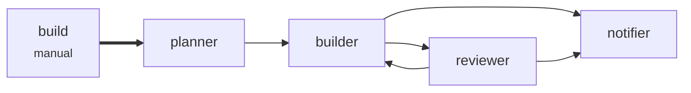
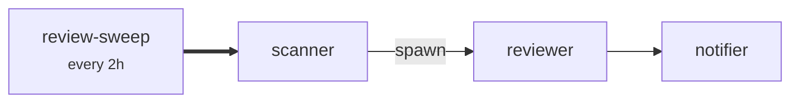

# Two workflows that share a reviewer

A **build** workflow takes a task to a reviewed change. A **review sweep** reviews the team's open
pull requests every two hours, one reviewer per pull request. Both use the same `reviewer`, because
a review is a review — but only the build may hand the `builder` work.

That is what `pipelines` on a route is for.

## The build



## The sweep



These are the diagrams `layover graph --pipeline build` and `--pipeline review-sweep` print, and
the ones the dashboard draws for each workflow.

## Why the reviewer's route to the builder is scoped

In a build, the reviewer must be able to send the builder its findings; that is the rework loop.
In a sweep, the reviewer reads pull request text that anyone can write. With one route map for the
whole factory, the route that makes the loop work would also let a sweep's reviewer hand the
builder — the one agent that edits code — whatever a pull request asked it to. Only its prompt
would stand in the way.

```toml
[[routes]]
from      = "reviewer"
to        = "builder"
pipelines = "build"
```

A sweep's chain may use only the global routes and those scoped to `review-sweep`, so the Tower
refuses that send: `layover_send` answers "call layover_peers", and `layover_peers` does not list
the builder. The agent cannot argue its way into the other workflow, because which pipeline a chain
belongs to is the Tower's record, not something a tool call carries.

Spawned reviewers are still the sweep's. A `mode = "spawn"` flight opens a new itinerary with its
own Fuel, and that itinerary **inherits** the spawning chain's pipeline — otherwise every spawned
review would fall back to the global routes and lose its own.

## Why the notifier's route is not scoped

```toml
[[routes]]
from = ["builder", "reviewer"]
to   = "notifier"
```

A route with no `pipelines` is **global**: every chain may use it, exactly as every route did
before scopes existed. Both workflows post a summary, so the route belongs to neither.

## What validation checks

`layover validate` runs its reach, hop and flag checks per workflow, over the routes that workflow
may use. Here, the sweep does not reach the builder, so the sweep would not have to declare a flag
that only the builder's prompt tests. It also refuses a pipeline name no pipeline has, and warns
about a scoped route that no chain of its workflows can reach.

## Running it

```console
$ layover --config examples/build-and-review/layover.toml validate --strict
$ layover --config examples/build-and-review/layover.toml explain
$ layover --config examples/build-and-review/layover.toml graph --pipeline review-sweep
```

See [Scoping a route to workflows](https://kotkaz.github.io/layover-project/configuration.html#scoping-a-route-to-workflows)
for the whole of the syntax, and [`docs/routing.md`](../../docs/routing.md) for how a chain's
pipeline is decided.
