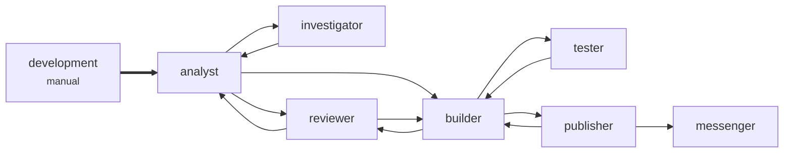
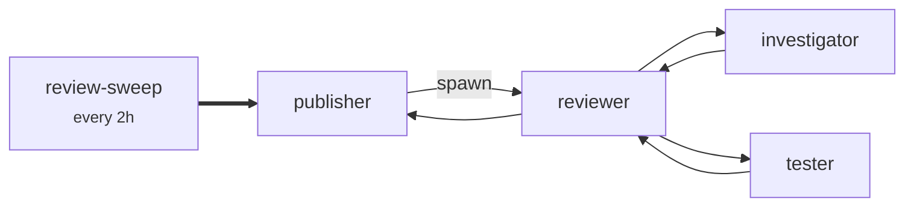
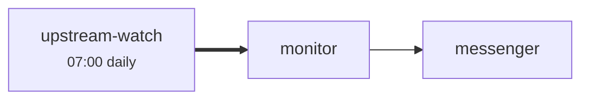

# Four workflows, one team

A team's factory, shaped after one that has run unattended for weeks. Eight agents, one runner and
four workflows that share them:

| Workflow | Starts | From | Does |
|---|---|---|---|
| `development` | When a person triggers it | `analyst` | Takes a task through spec, build, test and review, and as far as a published pull request as its flags allow. |
| `development-follow-up` | Every 30 minutes | whoever set the work down | Picks up published pull requests the publisher set down, and answers their review comments through the same gates. |
| `review-sweep` | Every 2 hours | `publisher` | Reviews every open pull request the team is asked to review, one itinerary per pull request. |
| `upstream-watch` | Every morning at 07:00 | `monitor` | Reads what changed upstream and tells the team what could break. |

Only two agents ever speak outside the factory: the **publisher** in the code host, the
**messenger** in the team chat. Every other agent's work reaches people through one of them.

The [build-and-review](../build-and-review/) example shows why a route is scoped to a workflow.
This one shows what a real factory adds once there are several: one runner for every agent, a
shared agent running differently in each workflow, flags declared wherever they are reached, a
follow-up that picks work back up days later, and runs a person names.

## The workflows



`development-follow-up` uses the same routes. What it wakes is whoever set the work down — in
practice the publisher, after it published a pull request — so the follow-up can send the builder
review comments to fix, and they go back through the tester and the reviewer like any other change.





`layover graph --pipeline <name>` prints each of these, and the dashboard draws one per workflow.

## One runner for every agent

```toml
[runners.copilot]
cli  = "copilot"
args = ["--disable-builtin-mcps", "--deny-tool=shell(gh:*)", "--deny-tool=shell(copilot:*)",
        "--deny-url=chat.example.com"]
```

`cli = "copilot"` has Layover supply what every unattended Copilot run needs: the agent's model,
effort and context, the session's name, `--allow-all-tools/paths/urls`, `--no-ask-user`,
`--output-format json` and the MCP wiring. So the runner says only what it is *for* — what every
agent here is denied — and an agent's own `args` say what it is denied beyond that:

```toml
[agents.tester]
model = "gpt-6.1-sol"
args  = ["--deny-tool=shell(git commit)", "--deny-tool=shell(git push)",
         "--deny-tool=shell(git reset)", "--deny-tool=shell(git stash)"]
```

Arguments only ever add up — the runner's, then the agent's, then the workflow's. Nothing an agent
or a workflow says can take away a deny rule the runner holds, and `layover validate` warns when an
agent repeats one the preset already supplies.

The factory this is modelled on had five Copilot runners that repeated the same twenty-five
arguments and differed only in their deny rules. A copy-and-edit dropped two deny rules from every
one of them for a week before anybody noticed. Here, the rules every agent shares are written once.

## How hard each agent thinks

```toml
[defaults]
effort  = "xhigh"
context = "long_context"
```

Every agent thinks at `xhigh` over a long context unless it says otherwise. The publisher says
`effort = "high"`, because publishing is procedure rather than judgement; the messenger says
`effort = "high"` and `context = "default"`, because it posts a few lines. Values are passed to the
CLI exactly as written, and the CLI decides whether its model accepts them.

## A shared agent, run differently in one workflow

The reviewer does the same job in two workflows, at different scales: development's gate reviews
one change at a time, and a sweep reviews a dozen pull requests every two hours. A sweep reviews a
pull request as published, too, so it has no reason to check anything out.

```toml
[pipelines.review-sweep.agents.reviewer]
effort = "high"
args   = ["--deny-tool=shell(git checkout)"]
```

That is the whole change. There is no second reviewer to keep in step with the first and no second
runner to repeat the deny rules in. The reviewer in a development chain and in a sweep runs:

```text
development:  copilot --model=claude-opus-5.5 --reasoning-effort=xhigh --context=long_context …
              --deny-tool=shell(git commit) --deny-tool=shell(git push) --additional-mcp-config @…
review-sweep: copilot --model=claude-opus-5.5 --reasoning-effort=high --context=long_context …
              --deny-tool=shell(git commit) --deny-tool=shell(git push)
              --deny-tool=shell(git checkout) --additional-mcp-config @…
```

`upstream-watch` does the same for the messenger, at `effort = "medium"`. `layover explain` prints
`here reviewer runs on claude-opus-5.5 · effort high · long context` under the sweep, and
`layover prompt reviewer --pipeline review-sweep` says the same.

Who decides, highest first: a choice made when the run was triggered, then the workflow's
`[pipelines.<name>.agents.<agent>]`, then the agent's own value, then `[defaults]`.

## Routes scoped to their workflows

Every route names the workflows whose chains may use it. A sweep's reviewer reads pull request
text anybody can write, and the route that lets development's reviewer send the builder its
findings is not one a sweep may use, so no pull request can talk a sweep into handing the builder
work. [build-and-review](../build-and-review/README.md#why-the-reviewers-route-to-the-builder-is-scoped)
explains this in full.

Two things keep their workflow:

- **A spawned review is the sweep's.** `publisher -- spawn --> reviewer` gives each pull request a
  fresh itinerary with its own Fuel, so a dozen reviews never compete for one budget, and the new
  itinerary inherits the sweep's routes, flags and name.
- **A follow-up is held to development's routes.** `development-follow-up` picks up whatever layover
  comes due, but a resumed chain may use a route only when the workflow that set the work down
  permits it too. A sweep that set work down could not reach the builder by waiting.

## Flags, declared wherever they are reached

The publisher's prompt tests `publish_pr` and `announce_pr`, and the tester's tests `run_e2e`.
Three workflows reach one or both of those agents, so all three declare the same three flags.
`layover validate` refuses a workflow that reaches a prompt testing a flag it does not declare: a
flag nobody declared is a mistake, and reading it as false would let a typo delete a section of an
agent's instructions without anybody noticing.

A flag is chosen when a person triggers `development`, and holds for everything that run causes —
the follow-up included, days later, which takes its values from the chain that set the work down
rather than its own defaults. A schedule that starts fresh work fires with the declared defaults,
so the review sweep never opens a pull request by itself, and the follow-up only ever carries on
with what a person chose.

## Triggering a run, and naming it

Open the dashboard, choose **Trigger a workflow** and pick `development`. Then:

- **Name** it — `Login page: retry banner`. The Chains list, the chain's own page, Sessions,
  Upcoming and Runs all show that, so three development runs going at once are three names. Each
  Copilot session is called `Login page: retry banner - analyst`, `… - builder` and so on, so you
  can find them among your own Copilot sessions.
- Switch on `publish_pr` if this run may open a pull request.
- Under **Model, effort and context for this run**, type `max` beside the analyst if this task
  needs it. That holds for this run and everything it causes, and for nothing else.

The same over HTTP:

```sh
curl -X POST localhost:7878/flights -H 'content-type: application/json' -d '{
  "pipeline": "development",
  "name": "Login page: retry banner",
  "body": "Show a retry banner when the login request times out.",
  "flags": { "publish_pr": true },
  "agents": { "analyst": { "effort": "max" } }
}'
```

## Before running it

This is an example of a factory that *acts*. Two MCP servers, `codehost-mcp` and `chat-mcp`, stand
in for whatever gives your publisher the code host and your messenger the team chat; replace them
with your own, and name their credentials in `env_from` rather than writing them here. Point
`work_dir` at a checkout you are happy for the builder to change. The rails are sized for a
development chain of about fifteen flights on its happy path, and the `[reserve]` caps what the
whole factory spends in any 24 hours, schedules included.

```console
$ layover --config examples/multi-workflow/layover.toml validate --strict
$ layover --config examples/multi-workflow/layover.toml explain
$ layover --config examples/multi-workflow/layover.toml graph --pipeline review-sweep
$ layover --config examples/multi-workflow/layover.toml prompt publisher --pipeline development --flag publish_pr=true
```

See [Pipelines and triggers](https://kotkaz.github.io/layover-project/pipelines.html) for workflows,
flags and follow-ups, and [Configuration](https://kotkaz.github.io/layover-project/configuration.html#runners--how-to-invoke-a-cli)
for runners and their presets.
