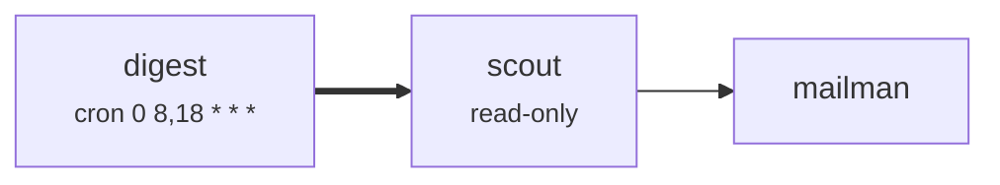

# A twice-daily news digest

The smallest factory that is still worth running, and the one to copy first.



A schedule fires, the scout reads and decides what matters, the mailman writes it up and posts it.
Two agents, one route, no joins and no fan-out.

## Why two agents and not one

Finding what matters and writing it up are different jobs, and an agent doing both does both
worse. The scout reads widely and keeps almost nothing; the mailman trusts that judgement and
spends its attention on the prose. Splitting them also means the scout can be `read-only` — it
gets a worktree snapshot and cannot touch the live tree.

It is the same split as [the reference factory](../workitem-factory/README.md), at the smallest
scale it makes sense at.

## The two things worth copying

**Both agents are told to produce nothing rather than pad.** The scout is told a quiet day is a
real result, and the mailman is told not to post an empty digest. Automated digests fail the same
way every time: nothing happened, the slot needed filling, and the reader learns to stop opening
it.

**Every item needs a source that was actually read.** Not inferred from a headline. An agent that
reports a story it could not open is a plausible-sounding agent, which is worse than a silent one.

## The cron time zone

`0 8,18 * * *` means eight and six in the Tower's **local** zone, and the schedule records which
zone that was. Calendar things are reckoned locally here, the same rule the
[cost windows](../../book/src/cost.md) follow, because "eight in the morning" means eight in the
morning to whoever wrote it.

## Running it

```console
$ layover --config examples/news-digest/layover.toml validate
$ layover --config examples/news-digest/layover.toml prompt scout --flag deep=true
```

That second command renders the prompt exactly as a run would receive it, without spending a real
invocation to find out what the `deep` flag composes to.
