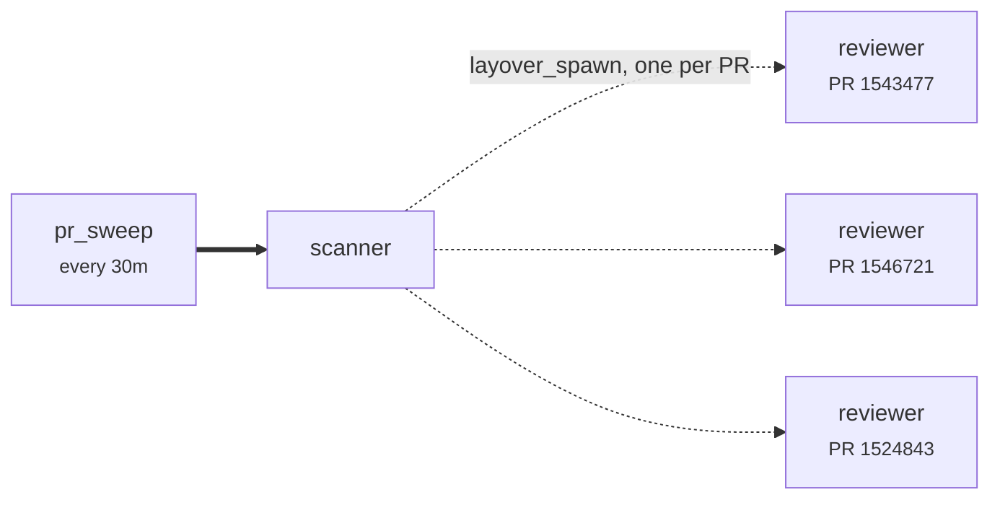

# Reviewing every pull request assigned to you

Every half hour, look at what is assigned to you in Azure DevOps and review each one — **one
agent per pull request**, working in parallel, each with its own budget and its own worktree.



## Why the reviewers are spawned rather than routed

The obvious way to write this is a route from `scanner` to `reviewer` and let the scanner send one
flight per pull request. That works, and it is wrong in two ways that only show up in production.

**Every reviewer would share one Fuel budget.** The itinerary's Fuel is the chain's, not the
item's, so "review everything assigned to me" quietly becomes "review however many finish before
the money runs out" — and *which* ones is whichever happened to be quickest. A sweep that silently
skips the important pull request is worse than one that does not run.

**Every reviewer would share one workspace.** `workspace = "per-itinerary"` isolates one sweep
from the next, not one reviewer from its siblings.

`layover_spawn` opens a **sibling itinerary** per item instead. Each gets its own Fuel, its own hop
budget, its own worktree, and each draws on the factory-wide Reserve — so the total is still
bounded, but by a number that means something.

## What stops fifty pull requests taking the machine down

Two rails, and they bound different things.

`max_concurrent_runs` bounds how many agent CLIs are alive **at once**. Fifty assigned pull
requests do not start fifty processes; they start four, and the other forty-six **queue**. That is
the one rail that queues rather than refusing, because a busy machine will not be busy in a
minute, and refusing would silently drop work.

`max_spawn_generations = 1` stops the recursion. A spawned itinerary gets *fresh* Hops, so Hops
cannot see across chains — without a generation limit, an agent that spawns an agent that spawns
an agent runs forever while every individual chain looks perfectly well behaved. Here the scanner
may spawn reviewers; a reviewer may not spawn anything.

## The reviewer never sees more than one pull request

Deliberate, and it is the reason to spawn at all. A reviewer handed six pull requests spends its
context switching between them and reviews all six worse than it would review one. Each spawned
itinerary carries exactly one.

## Running it

```console
$ layover --config examples/pr-review/layover.toml validate
$ layover --config examples/pr-review/layover.toml graph --svg > sweep.svg
```

The sweep needs an `az` login that can read your pull requests; credentials reach the child CLI
through the environment, never through this file.
