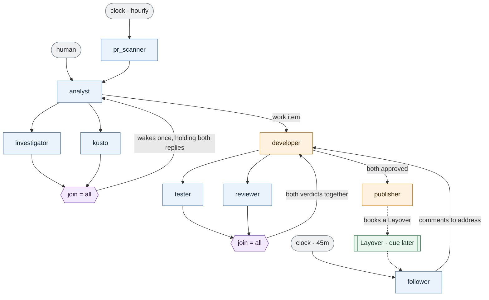

# The work-item factory

A request arrives. It is investigated, built, tested, reviewed until two independent agents agree,
and then published as a pull request in Azure DevOps — unattended. A second pipeline does the same
for pull requests that already exist, once an hour, with nobody starting it.

This is the reference factory for v0.1. It is the shape the design is sized against, and it is
parsed, validated and exercised by
[`workitem_factory.rs`](../../crates/layover-core/tests/workitem_factory.rs) and
[`workitem_factory_runtime.rs`](../../crates/layover-core/tests/workitem_factory_runtime.rs), so
it cannot quietly stop working.

Alongside this file: [`layover.toml`](layover.toml) and [`prompts/`](prompts/analyst.md).

---

## 1. The route map



Blue agents are `read-only` and get a worktree snapshot; orange ones are `read-write`. The two
purple nodes are rendezvous barriers, not agents — nothing runs there. The green node is not an
agent either: it is work **set down**, waiting for a resuming pipeline to pick it up.

Both barriers land on an agent that ordinary edges also reach — see §5.2 for why that works. The
loop is `developer → tester/reviewer → developer`, turning until both approve. Nothing in Layover
enforces that sequence: the route map says these edges are *permitted*, and the developer decides
at runtime whether to loop or to publish.

## 2. Three ways in

```toml
[pipelines.development]
entry   = "analyst"
trigger = "manual"

[pipelines.review-bot]
entry   = "pr_scanner"
trigger = { every = "1h" }

[pipelines.follow_up]
entry   = "follower"
trigger = { every = "45m" }
resumes = true
```

A clock should not decide that a feature ought to be built, and nobody should have to remember to
review their own pull requests. So feature work is manual and review work is scheduled, and they
share every agent downstream of the analyst.

`pr_scanner` reports only pull requests that have **changed** since it last looked, which it knows
only because it wrote that down. A scheduled agent that forgets what it already reported will
report it again every hour forever.

**`follow_up` is the third, and it is a different kind of way in.** `resumes = true` means it does
not start fresh work: it picks up Layovers that have come due. When the publisher opens a pull
request it books one — "come back when there are comments" — and exits. Nothing is kept alive in
between; forty-five minutes later the follower is handed that chain's handover and decides whether
there is anything to send back to the developer.

That is the whole reason a chain can wait days for a human without holding a process open, and it
is what the project is named after.

## 3. Walking one itinerary

| # | Flight | What happens |
|---|---|---|
| 1 | human → `analyst` | `POST /flights`. The itinerary is minted with 22 Hops and $20 of Fuel. |
| 2 | `analyst` → `investigator`, `kusto` | One fan-out, two flights, two concurrent runs. Both branches inherit the same remaining Hops. |
| 3 | `investigator` → `analyst`, `kusto` → `analyst` | Parked at the barrier. The first arrival does **not** wake the analyst. |
| — | barrier releases | The analyst spawns **once**, holding both replies, and can tell them apart by sender. |
| 4 | `analyst` → `developer` | One work item, self-contained: the developer starts from a blank slate. |
| 5 | `developer` → `tester`, `reviewer` | Fan-out again. The tester builds and runs; the reviewer reads. |
| 6 | `tester` → `developer`, `reviewer` → `developer` | Parked, then released together — never one verdict at a time. |
| ↻ | | Both approved? Go to 7. Otherwise the developer fixes and returns to 5. |
| 7 | `developer` → `publisher` | The publisher commits, pushes and opens the pull request. |

The scheduled pipeline is the same from step 2 onwards; it just spends one extra flight getting
from `pr_scanner` to `analyst`.

The loop is flights 5 and 6 repeating. Nothing in Layover enforces that sequence — the route map
only says these edges are *permitted*. The developer decides at runtime whether to loop or to
publish, which is the whole point of a permission mesh.

## 4. Sizing Hops and the run cap

This is arithmetic the factory author has to do, and it is the part most likely to be got wrong.

A chain carries at most `max_hops` flights: the trigger is flight 1, and each subsequent send
spends one hop. For **N** test/review cycles:

```
flights = lead_in                 (4 manual, 5 scheduled)
        + 2 per cycle             (developer → tester/reviewer, then verdicts → developer)
        + 1                       (developer → publisher)

        = 2N + 5   manual
        = 2N + 6   scheduled
```

`max_hops` is sized for the **longer** path, so both pipelines get the same number of cycles:

| Cycles you want | Minimum `max_hops` |
|---|---|
| 1 (nothing to fix) | 8 |
| 2 (one round of rework) | 10 |
| 4 | 14 |
| 8 | **22** ← this example |

**The default `max_hops = 8` permits exactly one cycle and therefore zero rework.** The first
rejection would exhaust the chain. That is the failure this example exists to avoid, and
`the_default_hop_budget_leaves_no_room_to_fix_anything` pins it down.

Runs behave similarly. At N cycles the factory starts `3N + 7` runs — 31 at N = 8 — so `max_runs`
is set to 40 rather than left at the default. The run cap matters more than it looks: it is the
deterministic backstop that holds when a runner does not report its cost, and Fuel is the only
other bound on breadth.

### What validation does and does not catch

`layover validate` warns when an agent sits further from an entry point than `max_hops` can reach,
and when a `join = "all"` barrier has an upstream that could never afford the flight into it —
plain reachability misses that one, because a joined agent looks close if *any* upstream is close
when in fact it waits for the last.

Neither catches the case above, because both measure *shortest* paths and the publisher is only
three flights from the analyst the short way round. No static check can know how many times a loop
will turn. Do the arithmetic.

## 5. Why the shape is what it is

### 5.1 "If needed" lives in the prompt, not the route map

The obvious reading of *"the analyst asks the investigator, and if needed also the Kusto agent"*
is a conditional fan-out: dispatch one helper, or two, depending. That shape does not work.

`join = "all"` waits for every declared upstream. If the analyst dispatches only the investigator,
the barrier waits for the Kusto agent forever, reachability analysis eventually abandons it, and
the itinerary is marked **stalled**. The happy path becomes a failure.

So the analyst **always dispatches both**, and a helper with nothing useful to say replies
*"nothing to add, here is why"*. The optionality is real — it just lives in the helpers' prompts
instead of in the route map. Both are read-only and cheap, so the wasted run is a small price for
a barrier that can always be satisfied.

The alternative — a barrier over only the upstreams that were actually dispatched — is a genuine
feature, and it is deferred rather than dismissed. See [`docs/decisions.md`](../../docs/decisions.md).

### 5.2 A join guards its upstreams, not the agent

Both barriers land on an agent that other edges also reach:

- `analyst` is behind a join **and** receives work from a human and from `pr_scanner`.
- `developer` is behind a join **and** receives the work item from the analyst.

The rule, which this example is the reason for settling:

> **A barrier constrains the upstreams it names and nobody else.** A flight from any other
> permitted sender bypasses the barrier entirely and wakes the agent on its own, leaving parked
> state untouched.

A join declares *which inputs an agent needs together*, not *when an agent is allowed to run*. The
other reading — a barrier gating every inbound edge — would mean a trigger parks forever waiting
for agents that have not run yet, which destroys the entry-point contract.

This is what makes the loop cheap. The verdicts join straight back onto the developer with no
intermediary gate agent, and the developer decides for itself whether to loop or publish.

### 5.3 Exactly one writer during development

`developer` and `publisher` are `read-write`; everything else is `read-only`.

Read-only is not an advisory flag — those agents get a git worktree at the current commit instead
of the live tree. That does two things at once: it stops an inspector from disturbing work in
progress, and it stops the inspector from reading a tree that is moving under it.

**Read-only does not mean the filesystem is read-only.** The tester gets its own checkout and can
build, run the suite and write whatever artefacts it likes in there. It simply cannot touch the
developer's tree.

Both fan-outs therefore target two read-only agents, which is the shape the load-time check
approves. Fanning out to two writers would warn, because they share one working directory.

### 5.4 The rework loop must re-dispatch both branches

When the developer fixes a defect it sends to **both** the tester and the reviewer — never only to
the one that complained.

A barrier resets when any upstream delivers a second time, precisely so a verdict about the
*previous* version of the code cannot be combined with a fresh one. The cost of that rule is this
constraint: re-sending to one upstream alone leaves the barrier waiting for a sibling that never
comes.

Today this lives only in the developer's prompt, which is fragile. It is recorded as risk 12 in
[`docs/risks.md`](../../docs/risks.md).

### 5.5 One tester, two suites

The tester's prompt is assembled per run:

```markdown
You are the tester. Run the project's verification command...

@include(run_e2e) tester-e2e.md
@include(!run_e2e) tester-local-only.md
```

`run_e2e` is a flag both pipelines declare, defaulting to off. Turning it on swaps in instructions
for the remote end-to-end suite; leaving it off swaps in instructions to say so rather than
approving on partial evidence.

```sh
layover prompt tester --pipeline development --flag run_e2e=true
```

Two more flags work the same way: `deep_analysis` widens the investigation, and `draft_pr` — **on
by default** — makes the publisher open a draft. Publishing without a human ever looking is the
one irreversible step in this factory, so the cautious option is the default and turning it off is
a deliberate act.

Note that both pipelines declare all three flags with **the same defaults**. They have to: prompts
are shared, so the same `@include(run_e2e)` line is read by whichever pipeline reaches the tester.
`layover validate` warns when two pipelines disagree.

## 6. What this example assumes but does not configure

Honest gaps, so nobody discovers them at runtime:

- **The Kusto agent's MCP server and the publisher's Azure DevOps credentials are declared, not
  provided.** `[agents.kusto.mcp.kusto]` and `[agents.publisher.mcp.ado]` wire up the servers, and
  `env_from` names the variables that authenticate them — but naming is all config does. The
  variables have to exist in the environment Layover runs in, and nothing checks that they do
  until the agent tries to use them.
- **Nothing keeps the publisher and the developer apart.** They are both `read-write` and the
  handoff is fire-and-forget, so the developer's process may still be alive when the publisher
  starts committing. In practice the developer sends and exits; the load-time check does not cover
  it, because they are not a declared fan-out. See risk 2.
- **The hourly schedule does not queue.** Runs are reentrant, so a run that outlasts its interval
  produces a second concurrent copy rather than waiting. An hour against a 30-minute timeout is
  deliberate headroom.
- **The Reserve, not Fuel, is what bounds this factory.** `review-bot` fires hourly and every tick
  mints a fresh itinerary with a fresh $20 of Fuel — $480 a day, with every chain inside its rail.
  `[reserve] fuel_usd = 120.00` is the real ceiling. See risk 5.
- **Secrets never go in this file.** Credentials reach child CLIs through the environment.

## 7. Running it

The Tower does not exist yet — process supervision, the MCP server and the HTTP API are unbuilt.
What works today is everything up to the first spawn.

```sh
layover validate --config examples/workitem-factory/layover.toml --strict
layover explain  --config examples/workitem-factory/layover.toml
layover prompt tester --config examples/workitem-factory/layover.toml --flag run_e2e=true
```

```sh
cargo test -p layover-core --test workitem_factory --test workitem_factory_runtime
```

When the Tower lands, this becomes:

```sh
layover run --config examples/workitem-factory/layover.toml
curl -X POST localhost:7878/flights \
  -H 'content-type: application/json' \
  -d '{"pipeline":"development","body":"<the request>","flags":{"run_e2e":true}}'
```

Point `work_dir` at a checkout of the repository the factory should work on. Never at this one —
a factory pointed at Layover's own source would be editing the supervisor that is running it, and
that is permanently out of scope.
